.lst-kix\_sxkqnof9umcy-0>li:before{content:"" counter(lst-ctn-kix\_sxkqnof9umcy-0,decimal) ". "}.lst-kix\_sxkqnof9umcy-6>li{counter-increment:lst-ctn-kix\_sxkqnof9umcy-6}ol.lst-kix\_j4pf5yk5r7mq-7.start{counter-reset:lst-ctn-kix\_j4pf5yk5r7mq-7 0}.lst-kix\_sxkqnof9umcy-3>li:before{content:"" counter(lst-ctn-kix\_sxkqnof9umcy-3,decimal) ". "}ol.lst-kix\_itu8ltqa0kq7-0.start{counter-reset:lst-ctn-kix\_itu8ltqa0kq7-0 0}ol.lst-kix\_sxkqnof9umcy-4.start{counter-reset:lst-ctn-kix\_sxkqnof9umcy-4 0}ul.lst-kix\_46hwxj3p3jck-8{list-style-type:none}.lst-kix\_9lqbi36pnz77-7>li{counter-increment:lst-ctn-kix\_9lqbi36pnz77-7}.lst-kix\_sxkqnof9umcy-4>li:before{content:"" counter(lst-ctn-kix\_sxkqnof9umcy-4,lower-latin) ". "}ul.lst-kix\_46hwxj3p3jck-7{list-style-type:none}ul.lst-kix\_46hwxj3p3jck-6{list-style-type:none}.lst-kix\_sxkqnof9umcy-5>li:before{content:"" counter(lst-ctn-kix\_sxkqnof9umcy-5,lower-roman) ". "}ul.lst-kix\_46hwxj3p3jck-5{list-style-type:none}ul.lst-kix\_46hwxj3p3jck-4{list-style-type:none}ul.lst-kix\_46hwxj3p3jck-3{list-style-type:none}ul.lst-kix\_46hwxj3p3jck-2{list-style-type:none}.lst-kix\_j4pf5yk5r7mq-8>li{counter-increment:lst-ctn-kix\_j4pf5yk5r7mq-8}.lst-kix\_sxkqnof9umcy-7>li:before{content:"" counter(lst-ctn-kix\_sxkqnof9umcy-7,lower-latin) ". "}.lst-kix\_myxu5vuynw73-6>li{counter-increment:lst-ctn-kix\_myxu5vuynw73-6}.lst-kix\_sxkqnof9umcy-6>li:before{content:"" counter(lst-ctn-kix\_sxkqnof9umcy-6,decimal) ". "}.lst-kix\_sxkqnof9umcy-8>li:before{content:"" counter(lst-ctn-kix\_sxkqnof9umcy-8,lower-roman) ". "}ol.lst-kix\_oercktqqj4bb-6{list-style-type:none}ol.lst-kix\_oercktqqj4bb-5{list-style-type:none}ol.lst-kix\_oercktqqj4bb-8{list-style-type:none}ol.lst-kix\_oercktqqj4bb-7{list-style-type:none}ol.lst-kix\_oercktqqj4bb-2{list-style-type:none}ol.lst-kix\_oercktqqj4bb-1{list-style-type:none}ol.lst-kix\_oercktqqj4bb-4{list-style-type:none}ol.lst-kix\_oercktqqj4bb-3{list-style-type:none}ol.lst-kix\_oercktqqj4bb-0{list-style-type:none}.lst-kix\_itu8ltqa0kq7-7>li{counter-increment:lst-ctn-kix\_itu8ltqa0kq7-7}.lst-kix\_oercktqqj4bb-7>li{counter-increment:lst-ctn-kix\_oercktqqj4bb-7}ol.lst-kix\_9lqbi36pnz77-8.start{counter-reset:lst-ctn-kix\_9lqbi36pnz77-8 0}ul.lst-kix\_62q9gjfcmxbc-0{list-style-type:none}.lst-kix\_d61y4amsmeks-2>li:before{content:"\\0025a0 "}ul.lst-kix\_62q9gjfcmxbc-3{list-style-type:none}.lst-kix\_d61y4amsmeks-1>li:before{content:"\\0025cb "}ul.lst-kix\_62q9gjfcmxbc-4{list-style-type:none}ul.lst-kix\_62q9gjfcmxbc-1{list-style-type:none}ol.lst-kix\_7dk1qrbcs2rr-6.start{counter-reset:lst-ctn-kix\_7dk1qrbcs2rr-6 0}ul.lst-kix\_62q9gjfcmxbc-2{list-style-type:none}ul.lst-kix\_62q9gjfcmxbc-7{list-style-type:none}ul.lst-kix\_62q9gjfcmxbc-8{list-style-type:none}ul.lst-kix\_62q9gjfcmxbc-5{list-style-type:none}.lst-kix\_d61y4amsmeks-0>li:before{content:"\\0025cf "}ul.lst-kix\_62q9gjfcmxbc-6{list-style-type:none}.lst-kix\_sxkqnof9umcy-2>li:before{content:"" counter(lst-ctn-kix\_sxkqnof9umcy-2,lower-roman) ". "}.lst-kix\_sxkqnof9umcy-1>li:before{content:"" counter(lst-ctn-kix\_sxkqnof9umcy-1,lower-latin) ". "}.lst-kix\_c5i8clyz999h-0>li{counter-increment:lst-ctn-kix\_c5i8clyz999h-0}ol.lst-kix\_itu8ltqa0kq7-5.start{counter-reset:lst-ctn-kix\_itu8ltqa0kq7-5 0}.lst-kix\_8p7qun55khhe-3>li{counter-increment:lst-ctn-kix\_8p7qun55khhe-3}.lst-kix\_j4pf5yk5r7mq-4>li{counter-increment:lst-ctn-kix\_j4pf5yk5r7mq-4}ol.lst-kix\_oercktqqj4bb-0.start{counter-reset:lst-ctn-kix\_oercktqqj4bb-0 0}ol.lst-kix\_8p7qun55khhe-3.start{counter-reset:lst-ctn-kix\_8p7qun55khhe-3 0}.lst-kix\_c5i8clyz999h-7>li{counter-increment:lst-ctn-kix\_c5i8clyz999h-7}ol.lst-kix\_oercktqqj4bb-7.start{counter-reset:lst-ctn-kix\_oercktqqj4bb-7 0}ul.lst-kix\_p5pvscloiwz2-1{list-style-type:none}.lst-kix\_myxu5vuynw73-0>li:before{content:"" counter(lst-ctn-kix\_myxu5vuynw73-0,decimal) ". "}.lst-kix\_myxu5vuynw73-1>li:before{content:"" counter(lst-ctn-kix\_myxu5vuynw73-1,lower-latin) ". "}ul.lst-kix\_p5pvscloiwz2-2{list-style-type:none}ul.lst-kix\_p5pvscloiwz2-3{list-style-type:none}ul.lst-kix\_p5pvscloiwz2-4{list-style-type:none}ul.lst-kix\_p5pvscloiwz2-0{list-style-type:none}.lst-kix\_q0ppka5j8jge-1>li{counter-increment:lst-ctn-kix\_q0ppka5j8jge-1}.lst-kix\_myxu5vuynw73-4>li:before{content:"" counter(lst-ctn-kix\_myxu5vuynw73-4,lower-latin) ". "}ul.lst-kix\_p5pvscloiwz2-5{list-style-type:none}.lst-kix\_myxu5vuynw73-2>li:before{content:"" counter(lst-ctn-kix\_myxu5vuynw73-2,lower-roman) ". "}.lst-kix\_myxu5vuynw73-3>li:before{content:"" counter(lst-ctn-kix\_myxu5vuynw73-3,decimal) ". "}ul.lst-kix\_p5pvscloiwz2-6{list-style-type:none}ul.lst-kix\_p5pvscloiwz2-7{list-style-type:none}ul.lst-kix\_p5pvscloiwz2-8{list-style-type:none}ul.lst-kix\_kddwuvevhhif-0{list-style-type:none}ol.lst-kix\_j7l6xielazto-7{list-style-type:none}.lst-kix\_myxu5vuynw73-8>li:before{content:"" counter(lst-ctn-kix\_myxu5vuynw73-8,lower-roman) ". "}ul.lst-kix\_kddwuvevhhif-1{list-style-type:none}ol.lst-kix\_c5i8clyz999h-3.start{counter-reset:lst-ctn-kix\_c5i8clyz999h-3 0}ol.lst-kix\_j7l6xielazto-6{list-style-type:none}ol.lst-kix\_j7l6xielazto-5{list-style-type:none}ol.lst-kix\_j7l6xielazto-4{list-style-type:none}ul.lst-kix\_kddwuvevhhif-4{list-style-type:none}ul.lst-kix\_kddwuvevhhif-5{list-style-type:none}ul.lst-kix\_kddwuvevhhif-2{list-style-type:none}ul.lst-kix\_kddwuvevhhif-3{list-style-type:none}ol.lst-kix\_j7l6xielazto-8{list-style-type:none}.lst-kix\_itu8ltqa0kq7-3>li{counter-increment:lst-ctn-kix\_itu8ltqa0kq7-3}.lst-kix\_myxu5vuynw73-5>li:before{content:"" counter(lst-ctn-kix\_myxu5vuynw73-5,lower-roman) ". "}.lst-kix\_itu8ltqa0kq7-8>li:before{content:"" counter(lst-ctn-kix\_itu8ltqa0kq7-8,lower-roman) ". "}.lst-kix\_itu8ltqa0kq7-7>li:before{content:"" counter(lst-ctn-kix\_itu8ltqa0kq7-7,lower-latin) ". "}.lst-kix\_myxu5vuynw73-6>li:before{content:"" counter(lst-ctn-kix\_myxu5vuynw73-6,decimal) ". "}.lst-kix\_myxu5vuynw73-7>li:before{content:"" counter(lst-ctn-kix\_myxu5vuynw73-7,lower-latin) ". "}.lst-kix\_itu8ltqa0kq7-5>li:before{content:"" counter(lst-ctn-kix\_itu8ltqa0kq7-5,lower-roman) ". "}.lst-kix\_7dk1qrbcs2rr-6>li{counter-increment:lst-ctn-kix\_7dk1qrbcs2rr-6}.lst-kix\_p5pvscloiwz2-6>li:before{content:"\\0025cf "}.lst-kix\_j7l6xielazto-2>li{counter-increment:lst-ctn-kix\_j7l6xielazto-2}ol.lst-kix\_j4pf5yk5r7mq-0.start{counter-reset:lst-ctn-kix\_j4pf5yk5r7mq-0 0}ol.lst-kix\_q0ppka5j8jge-4.start{counter-reset:lst-ctn-kix\_q0ppka5j8jge-4 0}ol.lst-kix\_oercktqqj4bb-5.start{counter-reset:lst-ctn-kix\_oercktqqj4bb-5 0}.lst-kix\_itu8ltqa0kq7-1>li:before{content:"" counter(lst-ctn-kix\_itu8ltqa0kq7-1,lower-latin) ". "}ol.lst-kix\_7dk1qrbcs2rr-8.start{counter-reset:lst-ctn-kix\_7dk1qrbcs2rr-8 0}ol.lst-kix\_c5i8clyz999h-5.start{counter-reset:lst-ctn-kix\_c5i8clyz999h-5 0}.lst-kix\_itu8ltqa0kq7-3>li:before{content:"" counter(lst-ctn-kix\_itu8ltqa0kq7-3,decimal) ". "}.lst-kix\_p5pvscloiwz2-4>li:before{content:"\\0025cb "}ol.lst-kix\_oercktqqj4bb-2.start{counter-reset:lst-ctn-kix\_oercktqqj4bb-2 0}.lst-kix\_p5pvscloiwz2-2>li:before{content:"\\0025a0 "}.lst-kix\_oercktqqj4bb-3>li{counter-increment:lst-ctn-kix\_oercktqqj4bb-3}.lst-kix\_p5pvscloiwz2-0>li:before{content:"\\0025cf "}ol.lst-kix\_9lqbi36pnz77-1.start{counter-reset:lst-ctn-kix\_9lqbi36pnz77-1 0}ul.lst-kix\_iecjn01jklgb-0{list-style-type:none}.lst-kix\_9lqbi36pnz77-3>li{counter-increment:lst-ctn-kix\_9lqbi36pnz77-3}ul.lst-kix\_iecjn01jklgb-1{list-style-type:none}.lst-kix\_oercktqqj4bb-4>li{counter-increment:lst-ctn-kix\_oercktqqj4bb-4}ol.lst-kix\_j7l6xielazto-0.start{counter-reset:lst-ctn-kix\_j7l6xielazto-0 0}ul.lst-kix\_iecjn01jklgb-2{list-style-type:none}ul.lst-kix\_iecjn01jklgb-3{list-style-type:none}ul.lst-kix\_iecjn01jklgb-4{list-style-type:none}ul.lst-kix\_iecjn01jklgb-5{list-style-type:none}ul.lst-kix\_iecjn01jklgb-6{list-style-type:none}ul.lst-kix\_d61y4amsmeks-3{list-style-type:none}ul.lst-kix\_d61y4amsmeks-2{list-style-type:none}.lst-kix\_7dk1qrbcs2rr-7>li{counter-increment:lst-ctn-kix\_7dk1qrbcs2rr-7}ul.lst-kix\_d61y4amsmeks-1{list-style-type:none}.lst-kix\_c5i8clyz999h-4>li{counter-increment:lst-ctn-kix\_c5i8clyz999h-4}ul.lst-kix\_d61y4amsmeks-0{list-style-type:none}ol.lst-kix\_itu8ltqa0kq7-7.start{counter-reset:lst-ctn-kix\_itu8ltqa0kq7-7 0}ul.lst-kix\_d61y4amsmeks-8{list-style-type:none}.lst-kix\_q0ppka5j8jge-5>li{counter-increment:lst-ctn-kix\_q0ppka5j8jge-5}ul.lst-kix\_d61y4amsmeks-7{list-style-type:none}ol.lst-kix\_myxu5vuynw73-5.start{counter-reset:lst-ctn-kix\_myxu5vuynw73-5 0}ul.lst-kix\_d61y4amsmeks-6{list-style-type:none}ol.lst-kix\_c5i8clyz999h-8.start{counter-reset:lst-ctn-kix\_c5i8clyz999h-8 0}ul.lst-kix\_d61y4amsmeks-5{list-style-type:none}ul.lst-kix\_d61y4amsmeks-4{list-style-type:none}.lst-kix\_iecjn01jklgb-0>li:before{content:"\\0025cf "}ol.lst-kix\_j4pf5yk5r7mq-2.start{counter-reset:lst-ctn-kix\_j4pf5yk5r7mq-2 0}ol.lst-kix\_q0ppka5j8jge-2.start{counter-reset:lst-ctn-kix\_q0ppka5j8jge-2 0}.lst-kix\_jpta4hekiek8-0>li:before{content:"\\0025cf "}.lst-kix\_pt74hf6h9m9z-8>li:before{content:"\\0025a0 "}ol.lst-kix\_j4pf5yk5r7mq-0{list-style-type:none}ol.lst-kix\_j4pf5yk5r7mq-1{list-style-type:none}.lst-kix\_jpta4hekiek8-6>li:before{content:"\\0025cf "}ol.lst-kix\_j4pf5yk5r7mq-2{list-style-type:none}ol.lst-kix\_j4pf5yk5r7mq-3{list-style-type:none}ol.lst-kix\_j4pf5yk5r7mq-4{list-style-type:none}.lst-kix\_d61y4amsmeks-3>li:before{content:"\\0025cf "}ol.lst-kix\_j4pf5yk5r7mq-5{list-style-type:none}ul.lst-kix\_84k8cxta7moi-8{list-style-type:none}.lst-kix\_iecjn01jklgb-4>li:before{content:"\\0025cb "}ol.lst-kix\_j4pf5yk5r7mq-6{list-style-type:none}ul.lst-kix\_84k8cxta7moi-7{list-style-type:none}ul.lst-kix\_n95dxx4c4uvc-1{list-style-type:none}.lst-kix\_pt74hf6h9m9z-6>li:before{content:"\\0025cf "}ol.lst-kix\_j4pf5yk5r7mq-7{list-style-type:none}ul.lst-kix\_84k8cxta7moi-6{list-style-type:none}ol.lst-kix\_sxkqnof9umcy-2.start{counter-reset:lst-ctn-kix\_sxkqnof9umcy-2 0}ul.lst-kix\_n95dxx4c4uvc-0{list-style-type:none}ol.lst-kix\_j4pf5yk5r7mq-8{list-style-type:none}.lst-kix\_jpta4hekiek8-2>li:before{content:"\\0025a0 "}ul.lst-kix\_n95dxx4c4uvc-3{list-style-type:none}.lst-kix\_d61y4amsmeks-5>li:before{content:"\\0025a0 "}ul.lst-kix\_iecjn01jklgb-7{list-style-type:none}ul.lst-kix\_n95dxx4c4uvc-2{list-style-type:none}.lst-kix\_iecjn01jklgb-2>li:before{content:"\\0025a0 "}ul.lst-kix\_iecjn01jklgb-8{list-style-type:none}ul.lst-kix\_n95dxx4c4uvc-5{list-style-type:none}ul.lst-kix\_n95dxx4c4uvc-4{list-style-type:none}.lst-kix\_jpta4hekiek8-4>li:before{content:"\\0025cb "}ul.lst-kix\_n95dxx4c4uvc-7{list-style-type:none}ul.lst-kix\_n95dxx4c4uvc-6{list-style-type:none}.lst-kix\_pt74hf6h9m9z-4>li:before{content:"\\0025cb "}ul.lst-kix\_n95dxx4c4uvc-8{list-style-type:none}ol.lst-kix\_8p7qun55khhe-0.start{counter-reset:lst-ctn-kix\_8p7qun55khhe-0 0}.lst-kix\_c5i8clyz999h-4>li:before{content:"" counter(lst-ctn-kix\_c5i8clyz999h-4,lower-latin) ". "}.lst-kix\_c5i8clyz999h-6>li:before{content:"" counter(lst-ctn-kix\_c5i8clyz999h-6,decimal) ". "}.lst-kix\_d61y4amsmeks-7>li:before{content:"\\0025cb "}.lst-kix\_pt74hf6h9m9z-2>li:before{content:"\\0025a0 "}ul.lst-kix\_84k8cxta7moi-5{list-style-type:none}ul.lst-kix\_84k8cxta7moi-4{list-style-type:none}ul.lst-kix\_84k8cxta7moi-3{list-style-type:none}.lst-kix\_c5i8clyz999h-0>li:before{content:"" counter(lst-ctn-kix\_c5i8clyz999h-0,decimal) ". "}.lst-kix\_c5i8clyz999h-2>li:before{content:"" counter(lst-ctn-kix\_c5i8clyz999h-2,lower-roman) ". "}.lst-kix\_c5i8clyz999h-8>li:before{content:"" counter(lst-ctn-kix\_c5i8clyz999h-8,lower-roman) ". "}ul.lst-kix\_84k8cxta7moi-2{list-style-type:none}ul.lst-kix\_84k8cxta7moi-1{list-style-type:none}ol.lst-kix\_9lqbi36pnz77-3.start{counter-reset:lst-ctn-kix\_9lqbi36pnz77-3 0}.lst-kix\_jpta4hekiek8-8>li:before{content:"\\0025a0 "}ul.lst-kix\_84k8cxta7moi-0{list-style-type:none}.lst-kix\_pt74hf6h9m9z-0>li:before{content:"\\0025cf "}.lst-kix\_8p7qun55khhe-2>li{counter-increment:lst-ctn-kix\_8p7qun55khhe-2}.lst-kix\_iecjn01jklgb-6>li:before{content:"\\0025cf "}.lst-kix\_iecjn01jklgb-8>li:before{content:"\\0025a0 "}ol.lst-kix\_myxu5vuynw73-7.start{counter-reset:lst-ctn-kix\_myxu5vuynw73-7 0}ol.lst-kix\_sxkqnof9umcy-1.start{counter-reset:lst-ctn-kix\_sxkqnof9umcy-1 0}.lst-kix\_oercktqqj4bb-6>li:before{content:"" counter(lst-ctn-kix\_oercktqqj4bb-6,decimal) ". "}.lst-kix\_oercktqqj4bb-5>li:before{content:"" counter(lst-ctn-kix\_oercktqqj4bb-5,lower-roman) ". "}.lst-kix\_7dk1qrbcs2rr-0>li{counter-increment:lst-ctn-kix\_7dk1qrbcs2rr-0}.lst-kix\_oercktqqj4bb-2>li:before{content:"" counter(lst-ctn-kix\_oercktqqj4bb-2,lower-roman) ". "}.lst-kix\_oercktqqj4bb-1>li:before{content:"" counter(lst-ctn-kix\_oercktqqj4bb-1,lower-latin) ". "}.lst-kix\_62q9gjfcmxbc-0>li:before{content:"\\0025cf "}.lst-kix\_84k8cxta7moi-8>li:before{content:"\\0025a0 "}.lst-kix\_84k8cxta7moi-7>li:before{content:"\\0025cb "}.lst-kix\_myxu5vuynw73-7>li{counter-increment:lst-ctn-kix\_myxu5vuynw73-7}.lst-kix\_62q9gjfcmxbc-4>li:before{content:"\\0025cb "}.lst-kix\_62q9gjfcmxbc-3>li:before{content:"\\0025cf "}.lst-kix\_vchkpw5g86yx-5>li:before{content:"\\0025a0 "}.lst-kix\_kddwuvevhhif-3>li:before{content:"\\0025cf "}.lst-kix\_84k8cxta7moi-0>li:before{content:"\\0025cf "}ol.lst-kix\_c5i8clyz999h-1.start{counter-reset:lst-ctn-kix\_c5i8clyz999h-1 0}.lst-kix\_kddwuvevhhif-0>li:before{content:"\\0025cf "}.lst-kix\_kddwuvevhhif-7>li:before{content:"\\0025cb "}ol.lst-kix\_oercktqqj4bb-4.start{counter-reset:lst-ctn-kix\_oercktqqj4bb-4 0}.lst-kix\_vchkpw5g86yx-4>li:before{content:"\\0025cb "}.lst-kix\_kddwuvevhhif-8>li:before{content:"\\0025a0 "}ol.lst-kix\_9lqbi36pnz77-5.start{counter-reset:lst-ctn-kix\_9lqbi36pnz77-5 0}ol.lst-kix\_q0ppka5j8jge-0.start{counter-reset:lst-ctn-kix\_q0ppka5j8jge-0 0}.lst-kix\_84k8cxta7moi-4>li:before{content:"\\0025cb "}.lst-kix\_84k8cxta7moi-3>li:before{content:"\\0025cf "}.lst-kix\_vchkpw5g86yx-1>li:before{content:"\\0025cb "}.lst-kix\_vchkpw5g86yx-0>li:before{content:"\\0025cf "}.lst-kix\_kddwuvevhhif-4>li:before{content:"\\0025cb "}.lst-kix\_c5i8clyz999h-6>li{counter-increment:lst-ctn-kix\_c5i8clyz999h-6}.lst-kix\_j7l6xielazto-2>li:before{content:"" counter(lst-ctn-kix\_j7l6xielazto-2,lower-roman) ". "}.lst-kix\_7dk1qrbcs2rr-6>li:before{content:"" counter(lst-ctn-kix\_7dk1qrbcs2rr-6,decimal) ". "}.lst-kix\_j7l6xielazto-1>li:before{content:"" counter(lst-ctn-kix\_j7l6xielazto-1,lower-latin) ". "}ol.lst-kix\_9lqbi36pnz77-6.start{counter-reset:lst-ctn-kix\_9lqbi36pnz77-6 0}.lst-kix\_8p7qun55khhe-4>li{counter-increment:lst-ctn-kix\_8p7qun55khhe-4}.lst-kix\_vchkpw5g86yx-8>li:before{content:"\\0025a0 "}.lst-kix\_62q9gjfcmxbc-8>li:before{content:"\\0025a0 "}.lst-kix\_62q9gjfcmxbc-7>li:before{content:"\\0025cb "}.lst-kix\_evj0nwjzhcpt-1>li:before{content:"\\0025cb "}.lst-kix\_evj0nwjzhcpt-2>li:before{content:"\\0025a0 "}.lst-kix\_j7l6xielazto-6>li:before{content:"" counter(lst-ctn-kix\_j7l6xielazto-6,decimal) ". "}.lst-kix\_7dk1qrbcs2rr-2>li:before{content:"" counter(lst-ctn-kix\_7dk1qrbcs2rr-2,lower-roman) ". "}.lst-kix\_sxkqnof9umcy-7>li{counter-increment:lst-ctn-kix\_sxkqnof9umcy-7}.lst-kix\_evj0nwjzhcpt-5>li:before{content:"\\0025a0 "}.lst-kix\_7dk1qrbcs2rr-1>li:before{content:"" counter(lst-ctn-kix\_7dk1qrbcs2rr-1,lower-latin) ". "}.lst-kix\_7dk1qrbcs2rr-5>li:before{content:"" counter(lst-ctn-kix\_7dk1qrbcs2rr-5,lower-roman) ". "}.lst-kix\_itu8ltqa0kq7-6>li{counter-increment:lst-ctn-kix\_itu8ltqa0kq7-6}.lst-kix\_p5pvscloiwz2-8>li:before{content:"\\0025a0 "}.lst-kix\_j7l6xielazto-5>li:before{content:"" counter(lst-ctn-kix\_j7l6xielazto-5,lower-roman) ". "}.lst-kix\_evj0nwjzhcpt-6>li:before{content:"\\0025cf "}.lst-kix\_c5i8clyz999h-3>li{counter-increment:lst-ctn-kix\_c5i8clyz999h-3}.lst-kix\_itu8ltqa0kq7-6>li:before{content:"" counter(lst-ctn-kix\_itu8ltqa0kq7-6,decimal) ". "}.lst-kix\_itu8ltqa0kq7-2>li:before{content:"" counter(lst-ctn-kix\_itu8ltqa0kq7-2,lower-roman) ". "}ol.lst-kix\_9lqbi36pnz77-7.start{counter-reset:lst-ctn-kix\_9lqbi36pnz77-7 0}.lst-kix\_n95dxx4c4uvc-5>li:before{content:"\\0025a0 "}.lst-kix\_p5pvscloiwz2-5>li:before{content:"\\0025a0 "}.lst-kix\_j4pf5yk5r7mq-1>li{counter-increment:lst-ctn-kix\_j4pf5yk5r7mq-1}.lst-kix\_46hwxj3p3jck-0>li:before{content:"\\0025cf "}ol.lst-kix\_c5i8clyz999h-2.start{counter-reset:lst-ctn-kix\_c5i8clyz999h-2 0}.lst-kix\_p5pvscloiwz2-1>li:before{content:"\\0025cb "}.lst-kix\_itu8ltqa0kq7-1>li{counter-increment:lst-ctn-kix\_itu8ltqa0kq7-1}.lst-kix\_21mcvwid4wss-1>li:before{content:"\\0025cb "}.lst-kix\_sxkqnof9umcy-2>li{counter-increment:lst-ctn-kix\_sxkqnof9umcy-2}.lst-kix\_9lqbi36pnz77-0>li{counter-increment:lst-ctn-kix\_9lqbi36pnz77-0}ol.lst-kix\_myxu5vuynw73-8{list-style-type:none}ol.lst-kix\_myxu5vuynw73-5{list-style-type:none}.lst-kix\_c5i8clyz999h-1>li{counter-increment:lst-ctn-kix\_c5i8clyz999h-1}ol.lst-kix\_myxu5vuynw73-4{list-style-type:none}ol.lst-kix\_myxu5vuynw73-7{list-style-type:none}ol.lst-kix\_myxu5vuynw73-6{list-style-type:none}ol.lst-kix\_myxu5vuynw73-1{list-style-type:none}ul.lst-kix\_jpta4hekiek8-1{list-style-type:none}ol.lst-kix\_myxu5vuynw73-0{list-style-type:none}ul.lst-kix\_jpta4hekiek8-2{list-style-type:none}ol.lst-kix\_oercktqqj4bb-8.start{counter-reset:lst-ctn-kix\_oercktqqj4bb-8 0}ol.lst-kix\_myxu5vuynw73-3{list-style-type:none}ol.lst-kix\_myxu5vuynw73-2{list-style-type:none}ul.lst-kix\_jpta4hekiek8-0{list-style-type:none}.lst-kix\_46hwxj3p3jck-4>li:before{content:"\\0025cb "}ul.lst-kix\_jpta4hekiek8-7{list-style-type:none}ul.lst-kix\_jpta4hekiek8-8{list-style-type:none}.lst-kix\_21mcvwid4wss-5>li:before{content:"\\0025a0 "}.lst-kix\_46hwxj3p3jck-8>li:before{content:"\\0025a0 "}.lst-kix\_8p7qun55khhe-6>li{counter-increment:lst-ctn-kix\_8p7qun55khhe-6}ul.lst-kix\_jpta4hekiek8-5{list-style-type:none}ul.lst-kix\_jpta4hekiek8-6{list-style-type:none}ul.lst-kix\_jpta4hekiek8-3{list-style-type:none}.lst-kix\_n95dxx4c4uvc-1>li:before{content:"\\0025cb "}ul.lst-kix\_jpta4hekiek8-4{list-style-type:none}.lst-kix\_j7l6xielazto-5>li{counter-increment:lst-ctn-kix\_j7l6xielazto-5}.lst-kix\_q0ppka5j8jge-8>li{counter-increment:lst-ctn-kix\_q0ppka5j8jge-8}.lst-kix\_7dk1qrbcs2rr-3>li{counter-increment:lst-ctn-kix\_7dk1qrbcs2rr-3}.lst-kix\_q0ppka5j8jge-3>li{counter-increment:lst-ctn-kix\_q0ppka5j8jge-3}.lst-kix\_9lqbi36pnz77-8>li:before{content:"" counter(lst-ctn-kix\_9lqbi36pnz77-8,lower-roman) ". "}.lst-kix\_itu8ltqa0kq7-8>li{counter-increment:lst-ctn-kix\_itu8ltqa0kq7-8}.lst-kix\_9lqbi36pnz77-5>li{counter-increment:lst-ctn-kix\_9lqbi36pnz77-5}.lst-kix\_jpta4hekiek8-1>li:before{content:"\\0025cb "}.lst-kix\_j4pf5yk5r7mq-8>li:before{content:"" counter(lst-ctn-kix\_j4pf5yk5r7mq-8,lower-roman) ". "}.lst-kix\_q0ppka5j8jge-1>li:before{content:"" counter(lst-ctn-kix\_q0ppka5j8jge-1,lower-latin) ". "}ol.lst-kix\_c5i8clyz999h-0.start{counter-reset:lst-ctn-kix\_c5i8clyz999h-0 0}.lst-kix\_pt74hf6h9m9z-7>li:before{content:"\\0025cb "}.lst-kix\_j7l6xielazto-0>li{counter-increment:lst-ctn-kix\_j7l6xielazto-0}.lst-kix\_jpta4hekiek8-5>li:before{content:"\\0025a0 "}.lst-kix\_iecjn01jklgb-5>li:before{content:"\\0025a0 "}.lst-kix\_d61y4amsmeks-4>li:before{content:"\\0025cb "}.lst-kix\_pt74hf6h9m9z-3>li:before{content:"\\0025cf "}.lst-kix\_iecjn01jklgb-1>li:before{content:"\\0025cb "}.lst-kix\_oercktqqj4bb-0>li{counter-increment:lst-ctn-kix\_oercktqqj4bb-0}.lst-kix\_q0ppka5j8jge-5>li:before{content:"" counter(lst-ctn-kix\_q0ppka5j8jge-5,lower-roman) ". "}ol.lst-kix\_sxkqnof9umcy-3{list-style-type:none}ol.lst-kix\_sxkqnof9umcy-2{list-style-type:none}ol.lst-kix\_sxkqnof9umcy-5{list-style-type:none}ol.lst-kix\_sxkqnof9umcy-4{list-style-type:none}ol.lst-kix\_sxkqnof9umcy-7{list-style-type:none}.lst-kix\_c5i8clyz999h-3>li:before{content:"" counter(lst-ctn-kix\_c5i8clyz999h-3,decimal) ". "}.lst-kix\_c5i8clyz999h-7>li:before{content:"" counter(lst-ctn-kix\_c5i8clyz999h-7,lower-latin) ". "}ol.lst-kix\_sxkqnof9umcy-6{list-style-type:none}.lst-kix\_d61y4amsmeks-8>li:before{content:"\\0025a0 "}ol.lst-kix\_sxkqnof9umcy-8{list-style-type:none}.lst-kix\_9lqbi36pnz77-0>li:before{content:"" counter(lst-ctn-kix\_9lqbi36pnz77-0,decimal) ". "}ol.lst-kix\_9lqbi36pnz77-7{list-style-type:none}.lst-kix\_j4pf5yk5r7mq-0>li:before{content:"" counter(lst-ctn-kix\_j4pf5yk5r7mq-0,decimal) ". "}ol.lst-kix\_9lqbi36pnz77-8{list-style-type:none}ol.lst-kix\_9lqbi36pnz77-5{list-style-type:none}ol.lst-kix\_9lqbi36pnz77-6{list-style-type:none}ol.lst-kix\_9lqbi36pnz77-3{list-style-type:none}ol.lst-kix\_sxkqnof9umcy-1{list-style-type:none}ol.lst-kix\_9lqbi36pnz77-4{list-style-type:none}ol.lst-kix\_sxkqnof9umcy-0{list-style-type:none}ol.lst-kix\_9lqbi36pnz77-1{list-style-type:none}.lst-kix\_9lqbi36pnz77-4>li:before{content:"" counter(lst-ctn-kix\_9lqbi36pnz77-4,lower-latin) ". "}ol.lst-kix\_q0ppka5j8jge-1{list-style-type:none}ol.lst-kix\_9lqbi36pnz77-2{list-style-type:none}ol.lst-kix\_q0ppka5j8jge-2{list-style-type:none}ol.lst-kix\_q0ppka5j8jge-3{list-style-type:none}.lst-kix\_j4pf5yk5r7mq-4>li:before{content:"" counter(lst-ctn-kix\_j4pf5yk5r7mq-4,lower-latin) ". "}ol.lst-kix\_9lqbi36pnz77-0{list-style-type:none}.lst-kix\_c5i8clyz999h-8>li{counter-increment:lst-ctn-kix\_c5i8clyz999h-8}ol.lst-kix\_q0ppka5j8jge-4{list-style-type:none}ol.lst-kix\_q0ppka5j8jge-0{list-style-type:none}.lst-kix\_myxu5vuynw73-2>li{counter-increment:lst-ctn-kix\_myxu5vuynw73-2}.lst-kix\_j4pf5yk5r7mq-6>li{counter-increment:lst-ctn-kix\_j4pf5yk5r7mq-6}ol.lst-kix\_q0ppka5j8jge-5{list-style-type:none}ol.lst-kix\_q0ppka5j8jge-6{list-style-type:none}ol.lst-kix\_q0ppka5j8jge-7{list-style-type:none}ol.lst-kix\_q0ppka5j8jge-8{list-style-type:none}.lst-kix\_l2sunq89ifep-5>li:before{content:"\\0025a0 "}ol.lst-kix\_7dk1qrbcs2rr-0{list-style-type:none}ol.lst-kix\_7dk1qrbcs2rr-2{list-style-type:none}.lst-kix\_8p7qun55khhe-1>li:before{content:"" counter(lst-ctn-kix\_8p7qun55khhe-1,lower-latin) ". "}ol.lst-kix\_7dk1qrbcs2rr-1{list-style-type:none}.lst-kix\_8p7qun55khhe-3>li:before{content:"" counter(lst-ctn-kix\_8p7qun55khhe-3,decimal) ". "}.lst-kix\_l2sunq89ifep-3>li:before{content:"\\0025cf "}.lst-kix\_l2sunq89ifep-7>li:before{content:"\\0025cb "}.lst-kix\_8p7qun55khhe-0>li:before{content:"" counter(lst-ctn-kix\_8p7qun55khhe-0,decimal) ". "}.lst-kix\_l2sunq89ifep-2>li:before{content:"\\0025a0 "}.lst-kix\_l2sunq89ifep-6>li:before{content:"\\0025cf "}.lst-kix\_8p7qun55khhe-4>li:before{content:"" counter(lst-ctn-kix\_8p7qun55khhe-4,lower-latin) ". "}.lst-kix\_itu8ltqa0kq7-5>li{counter-increment:lst-ctn-kix\_itu8ltqa0kq7-5}.lst-kix\_l2sunq89ifep-4>li:before{content:"\\0025cb "}.lst-kix\_8p7qun55khhe-2>li:before{content:"" counter(lst-ctn-kix\_8p7qun55khhe-2,lower-roman) ". "}ol.lst-kix\_myxu5vuynw73-6.start{counter-reset:lst-ctn-kix\_myxu5vuynw73-6 0}.lst-kix\_j7l6xielazto-7>li{counter-increment:lst-ctn-kix\_j7l6xielazto-7}ol.lst-kix\_7dk1qrbcs2rr-8{list-style-type:none}ol.lst-kix\_itu8ltqa0kq7-6.start{counter-reset:lst-ctn-kix\_itu8ltqa0kq7-6 0}ol.lst-kix\_7dk1qrbcs2rr-7{list-style-type:none}ol.lst-kix\_7dk1qrbcs2rr-4{list-style-type:none}ol.lst-kix\_7dk1qrbcs2rr-3{list-style-type:none}.lst-kix\_l2sunq89ifep-8>li:before{content:"\\0025a0 "}ol.lst-kix\_7dk1qrbcs2rr-6{list-style-type:none}.lst-kix\_8p7qun55khhe-1>li{counter-increment:lst-ctn-kix\_8p7qun55khhe-1}ol.lst-kix\_j7l6xielazto-4.start{counter-reset:lst-ctn-kix\_j7l6xielazto-4 0}ol.lst-kix\_7dk1qrbcs2rr-5{list-style-type:none}.lst-kix\_sxkqnof9umcy-8>li{counter-increment:lst-ctn-kix\_sxkqnof9umcy-8}ol.lst-kix\_c5i8clyz999h-4.start{counter-reset:lst-ctn-kix\_c5i8clyz999h-4 0}ol.lst-kix\_j4pf5yk5r7mq-1.start{counter-reset:lst-ctn-kix\_j4pf5yk5r7mq-1 0}ol.lst-kix\_q0ppka5j8jge-3.start{counter-reset:lst-ctn-kix\_q0ppka5j8jge-3 0}ol.lst-kix\_8p7qun55khhe-4.start{counter-reset:lst-ctn-kix\_8p7qun55khhe-4 0}.lst-kix\_7dk1qrbcs2rr-1>li{counter-increment:lst-ctn-kix\_7dk1qrbcs2rr-1}.lst-kix\_8p7qun55khhe-8>li:before{content:"" counter(lst-ctn-kix\_8p7qun55khhe-8,lower-roman) ". "}.lst-kix\_l2sunq89ifep-1>li:before{content:"\\0025cb "}ol.lst-kix\_oercktqqj4bb-1.start{counter-reset:lst-ctn-kix\_oercktqqj4bb-1 0}.lst-kix\_8p7qun55khhe-5>li:before{content:"" counter(lst-ctn-kix\_8p7qun55khhe-5,lower-roman) ". "}.lst-kix\_8p7qun55khhe-7>li:before{content:"" counter(lst-ctn-kix\_8p7qun55khhe-7,lower-latin) ". "}.lst-kix\_l2sunq89ifep-0>li:before{content:"\\0025cf "}.lst-kix\_8p7qun55khhe-6>li:before{content:"" counter(lst-ctn-kix\_8p7qun55khhe-6,decimal) ". "}.lst-kix\_myxu5vuynw73-4>li{counter-increment:lst-ctn-kix\_myxu5vuynw73-4}ul.lst-kix\_pt74hf6h9m9z-3{list-style-type:none}ul.lst-kix\_pt74hf6h9m9z-4{list-style-type:none}ol.lst-kix\_sxkqnof9umcy-5.start{counter-reset:lst-ctn-kix\_sxkqnof9umcy-5 0}ul.lst-kix\_pt74hf6h9m9z-5{list-style-type:none}ul.lst-kix\_pt74hf6h9m9z-6{list-style-type:none}ol.lst-kix\_itu8ltqa0kq7-8{list-style-type:none}ul.lst-kix\_pt74hf6h9m9z-7{list-style-type:none}ul.lst-kix\_pt74hf6h9m9z-8{list-style-type:none}ol.lst-kix\_itu8ltqa0kq7-4{list-style-type:none}ol.lst-kix\_itu8ltqa0kq7-5{list-style-type:none}ol.lst-kix\_itu8ltqa0kq7-6{list-style-type:none}.lst-kix\_7dk1qrbcs2rr-5>li{counter-increment:lst-ctn-kix\_7dk1qrbcs2rr-5}ol.lst-kix\_itu8ltqa0kq7-7{list-style-type:none}ol.lst-kix\_itu8ltqa0kq7-0{list-style-type:none}ol.lst-kix\_itu8ltqa0kq7-1{list-style-type:none}ol.lst-kix\_j4pf5yk5r7mq-6.start{counter-reset:lst-ctn-kix\_j4pf5yk5r7mq-6 0}ul.lst-kix\_pt74hf6h9m9z-0{list-style-type:none}ol.lst-kix\_itu8ltqa0kq7-2{list-style-type:none}ul.lst-kix\_pt74hf6h9m9z-1{list-style-type:none}ol.lst-kix\_itu8ltqa0kq7-3{list-style-type:none}ul.lst-kix\_pt74hf6h9m9z-2{list-style-type:none}.lst-kix\_sxkqnof9umcy-4>li{counter-increment:lst-ctn-kix\_sxkqnof9umcy-4}.lst-kix\_oercktqqj4bb-2>li{counter-increment:lst-ctn-kix\_oercktqqj4bb-2}.lst-kix\_oercktqqj4bb-5>li{counter-increment:lst-ctn-kix\_oercktqqj4bb-5}.lst-kix\_7dk1qrbcs2rr-8>li{counter-increment:lst-ctn-kix\_7dk1qrbcs2rr-8}ol.lst-kix\_oercktqqj4bb-6.start{counter-reset:lst-ctn-kix\_oercktqqj4bb-6 0}.lst-kix\_n95dxx4c4uvc-8>li:before{content:"\\0025a0 "}.lst-kix\_46hwxj3p3jck-1>li:before{content:"\\0025cb "}.lst-kix\_q0ppka5j8jge-6>li{counter-increment:lst-ctn-kix\_q0ppka5j8jge-6}ol.lst-kix\_7dk1qrbcs2rr-5.start{counter-reset:lst-ctn-kix\_7dk1qrbcs2rr-5 0}.lst-kix\_n95dxx4c4uvc-6>li:before{content:"\\0025cf "}.lst-kix\_sxkqnof9umcy-0>li{counter-increment:lst-ctn-kix\_sxkqnof9umcy-0}ol.lst-kix\_9lqbi36pnz77-4.start{counter-reset:lst-ctn-kix\_9lqbi36pnz77-4 0}.lst-kix\_j4pf5yk5r7mq-2>li{counter-increment:lst-ctn-kix\_j4pf5yk5r7mq-2}ol.lst-kix\_8p7qun55khhe-2.start{counter-reset:lst-ctn-kix\_8p7qun55khhe-2 0}.lst-kix\_9lqbi36pnz77-2>li{counter-increment:lst-ctn-kix\_9lqbi36pnz77-2}.lst-kix\_46hwxj3p3jck-3>li:before{content:"\\0025cf "}.lst-kix\_myxu5vuynw73-0>li{counter-increment:lst-ctn-kix\_myxu5vuynw73-0}.lst-kix\_9lqbi36pnz77-1>li{counter-increment:lst-ctn-kix\_9lqbi36pnz77-1}ol.lst-kix\_q0ppka5j8jge-1.start{counter-reset:lst-ctn-kix\_q0ppka5j8jge-1 0}ul.lst-kix\_21mcvwid4wss-6{list-style-type:none}ul.lst-kix\_21mcvwid4wss-5{list-style-type:none}ul.lst-kix\_21mcvwid4wss-8{list-style-type:none}ul.lst-kix\_21mcvwid4wss-7{list-style-type:none}.lst-kix\_j7l6xielazto-3>li{counter-increment:lst-ctn-kix\_j7l6xielazto-3}ul.lst-kix\_21mcvwid4wss-2{list-style-type:none}ul.lst-kix\_21mcvwid4wss-1{list-style-type:none}ul.lst-kix\_21mcvwid4wss-4{list-style-type:none}ul.lst-kix\_21mcvwid4wss-3{list-style-type:none}ul.lst-kix\_21mcvwid4wss-0{list-style-type:none}ol.lst-kix\_c5i8clyz999h-3{list-style-type:none}ol.lst-kix\_c5i8clyz999h-4{list-style-type:none}ol.lst-kix\_c5i8clyz999h-1{list-style-type:none}ol.lst-kix\_c5i8clyz999h-2{list-style-type:none}ul.lst-kix\_l2sunq89ifep-7{list-style-type:none}ol.lst-kix\_sxkqnof9umcy-0.start{counter-reset:lst-ctn-kix\_sxkqnof9umcy-0 0}ul.lst-kix\_l2sunq89ifep-8{list-style-type:none}ol.lst-kix\_c5i8clyz999h-0{list-style-type:none}ul.lst-kix\_l2sunq89ifep-5{list-style-type:none}ul.lst-kix\_l2sunq89ifep-6{list-style-type:none}.lst-kix\_21mcvwid4wss-0>li:before{content:"\\0025cf "}.lst-kix\_21mcvwid4wss-4>li:before{content:"\\0025cb "}ul.lst-kix\_l2sunq89ifep-3{list-style-type:none}ul.lst-kix\_l2sunq89ifep-4{list-style-type:none}ul.lst-kix\_l2sunq89ifep-1{list-style-type:none}ol.lst-kix\_myxu5vuynw73-8.start{counter-reset:lst-ctn-kix\_myxu5vuynw73-8 0}ul.lst-kix\_l2sunq89ifep-2{list-style-type:none}ol.lst-kix\_sxkqnof9umcy-3.start{counter-reset:lst-ctn-kix\_sxkqnof9umcy-3 0}ol.lst-kix\_c5i8clyz999h-7{list-style-type:none}ul.lst-kix\_l2sunq89ifep-0{list-style-type:none}ol.lst-kix\_c5i8clyz999h-8{list-style-type:none}ol.lst-kix\_c5i8clyz999h-5{list-style-type:none}.lst-kix\_21mcvwid4wss-2>li:before{content:"\\0025a0 "}ol.lst-kix\_c5i8clyz999h-6{list-style-type:none}.lst-kix\_n95dxx4c4uvc-2>li:before{content:"\\0025a0 "}.lst-kix\_n95dxx4c4uvc-0>li:before{content:"\\0025cf "}.lst-kix\_n95dxx4c4uvc-4>li:before{content:"\\0025cb "}.lst-kix\_21mcvwid4wss-8>li:before{content:"\\0025a0 "}.lst-kix\_46hwxj3p3jck-5>li:before{content:"\\0025a0 "}.lst-kix\_21mcvwid4wss-6>li:before{content:"\\0025cf "}.lst-kix\_46hwxj3p3jck-7>li:before{content:"\\0025cb "}ol.lst-kix\_9lqbi36pnz77-2.start{counter-reset:lst-ctn-kix\_9lqbi36pnz77-2 0}.lst-kix\_q0ppka5j8jge-4>li:before{content:"" counter(lst-ctn-kix\_q0ppka5j8jge-4,lower-latin) ". "}.lst-kix\_q0ppka5j8jge-2>li:before{content:"" counter(lst-ctn-kix\_q0ppka5j8jge-2,lower-roman) ". "}.lst-kix\_q0ppka5j8jge-6>li:before{content:"" counter(lst-ctn-kix\_q0ppka5j8jge-6,decimal) ". "}.lst-kix\_q0ppka5j8jge-0>li:before{content:"" counter(lst-ctn-kix\_q0ppka5j8jge-0,decimal) ". "}.lst-kix\_q0ppka5j8jge-8>li:before{content:"" counter(lst-ctn-kix\_q0ppka5j8jge-8,lower-roman) ". "}.lst-kix\_9lqbi36pnz77-7>li:before{content:"" counter(lst-ctn-kix\_9lqbi36pnz77-7,lower-latin) ". "}.lst-kix\_j4pf5yk5r7mq-7>li:before{content:"" counter(lst-ctn-kix\_j4pf5yk5r7mq-7,lower-latin) ". "}ol.lst-kix\_7dk1qrbcs2rr-7.start{counter-reset:lst-ctn-kix\_7dk1qrbcs2rr-7 0}ol.lst-kix\_itu8ltqa0kq7-8.start{counter-reset:lst-ctn-kix\_itu8ltqa0kq7-8 0}.lst-kix\_8p7qun55khhe-8>li{counter-increment:lst-ctn-kix\_8p7qun55khhe-8}ol.lst-kix\_c5i8clyz999h-7.start{counter-reset:lst-ctn-kix\_c5i8clyz999h-7 0}ol.lst-kix\_c5i8clyz999h-6.start{counter-reset:lst-ctn-kix\_c5i8clyz999h-6 0}.lst-kix\_j4pf5yk5r7mq-1>li:before{content:"" counter(lst-ctn-kix\_j4pf5yk5r7mq-1,lower-latin) ". "}.lst-kix\_9lqbi36pnz77-1>li:before{content:"" counter(lst-ctn-kix\_9lqbi36pnz77-1,lower-latin) ". "}.lst-kix\_9lqbi36pnz77-3>li:before{content:"" counter(lst-ctn-kix\_9lqbi36pnz77-3,decimal) ". "}.lst-kix\_9lqbi36pnz77-5>li:before{content:"" counter(lst-ctn-kix\_9lqbi36pnz77-5,lower-roman) ". "}ol.lst-kix\_j4pf5yk5r7mq-3.start{counter-reset:lst-ctn-kix\_j4pf5yk5r7mq-3 0}ol.lst-kix\_oercktqqj4bb-3.start{counter-reset:lst-ctn-kix\_oercktqqj4bb-3 0}.lst-kix\_j4pf5yk5r7mq-5>li:before{content:"" counter(lst-ctn-kix\_j4pf5yk5r7mq-5,lower-roman) ". "}.lst-kix\_c5i8clyz999h-5>li{counter-increment:lst-ctn-kix\_c5i8clyz999h-5}.lst-kix\_j4pf5yk5r7mq-3>li{counter-increment:lst-ctn-kix\_j4pf5yk5r7mq-3}.lst-kix\_j4pf5yk5r7mq-3>li:before{content:"" counter(lst-ctn-kix\_j4pf5yk5r7mq-3,decimal) ". "}.lst-kix\_myxu5vuynw73-5>li{counter-increment:lst-ctn-kix\_myxu5vuynw73-5}.lst-kix\_oercktqqj4bb-7>li:before{content:"" counter(lst-ctn-kix\_oercktqqj4bb-7,lower-latin) ". "}.lst-kix\_j7l6xielazto-8>li{counter-increment:lst-ctn-kix\_j7l6xielazto-8}.lst-kix\_oercktqqj4bb-4>li:before{content:"" counter(lst-ctn-kix\_oercktqqj4bb-4,lower-latin) ". "}.lst-kix\_oercktqqj4bb-8>li:before{content:"" counter(lst-ctn-kix\_oercktqqj4bb-8,lower-roman) ". "}ol.lst-kix\_itu8ltqa0kq7-3.start{counter-reset:lst-ctn-kix\_itu8ltqa0kq7-3 0}.lst-kix\_evj0nwjzhcpt-8>li:before{content:"\\0025a0 "}ol.lst-kix\_j7l6xielazto-1.start{counter-reset:lst-ctn-kix\_j7l6xielazto-1 0}.lst-kix\_oercktqqj4bb-3>li:before{content:"" counter(lst-ctn-kix\_oercktqqj4bb-3,decimal) ". "}.lst-kix\_8p7qun55khhe-0>li{counter-increment:lst-ctn-kix\_8p7qun55khhe-0}.lst-kix\_j4pf5yk5r7mq-7>li{counter-increment:lst-ctn-kix\_j4pf5yk5r7mq-7}ul.lst-kix\_vchkpw5g86yx-6{list-style-type:none}.lst-kix\_84k8cxta7moi-6>li:before{content:"\\0025cf "}ul.lst-kix\_vchkpw5g86yx-5{list-style-type:none}ul.lst-kix\_vchkpw5g86yx-4{list-style-type:none}ol.lst-kix\_j4pf5yk5r7mq-4.start{counter-reset:lst-ctn-kix\_j4pf5yk5r7mq-4 0}.lst-kix\_62q9gjfcmxbc-1>li:before{content:"\\0025cb "}ul.lst-kix\_vchkpw5g86yx-3{list-style-type:none}.lst-kix\_9lqbi36pnz77-8>li{counter-increment:lst-ctn-kix\_9lqbi36pnz77-8}.lst-kix\_62q9gjfcmxbc-2>li:before{content:"\\0025a0 "}ul.lst-kix\_vchkpw5g86yx-8{list-style-type:none}ul.lst-kix\_vchkpw5g86yx-7{list-style-type:none}.lst-kix\_evj0nwjzhcpt-0>li:before{content:"\\0025cf "}.lst-kix\_62q9gjfcmxbc-5>li:before{content:"\\0025a0 "}ul.lst-kix\_vchkpw5g86yx-2{list-style-type:none}ul.lst-kix\_vchkpw5g86yx-1{list-style-type:none}ul.lst-kix\_vchkpw5g86yx-0{list-style-type:none}.lst-kix\_q0ppka5j8jge-0>li{counter-increment:lst-ctn-kix\_q0ppka5j8jge-0}.lst-kix\_9lqbi36pnz77-6>li{counter-increment:lst-ctn-kix\_9lqbi36pnz77-6}.lst-kix\_itu8ltqa0kq7-4>li{counter-increment:lst-ctn-kix\_itu8ltqa0kq7-4}.lst-kix\_vchkpw5g86yx-7>li:before{content:"\\0025cb "}.lst-kix\_kddwuvevhhif-5>li:before{content:"\\0025a0 "}.lst-kix\_kddwuvevhhif-2>li:before{content:"\\0025a0 "}.lst-kix\_vchkpw5g86yx-6>li:before{content:"\\0025cf "}.lst-kix\_kddwuvevhhif-6>li:before{content:"\\0025cf "}ol.lst-kix\_8p7qun55khhe-1.start{counter-reset:lst-ctn-kix\_8p7qun55khhe-1 0}.lst-kix\_sxkqnof9umcy-5>li{counter-increment:lst-ctn-kix\_sxkqnof9umcy-5}.lst-kix\_kddwuvevhhif-1>li:before{content:"\\0025cb "}ol.lst-kix\_j7l6xielazto-7.start{counter-reset:lst-ctn-kix\_j7l6xielazto-7 0}.lst-kix\_vchkpw5g86yx-3>li:before{content:"\\0025cf "}.lst-kix\_84k8cxta7moi-5>li:before{content:"\\0025a0 "}.lst-kix\_q0ppka5j8jge-2>li{counter-increment:lst-ctn-kix\_q0ppka5j8jge-2}.lst-kix\_vchkpw5g86yx-2>li:before{content:"\\0025a0 "}.lst-kix\_84k8cxta7moi-2>li:before{content:"\\0025a0 "}.lst-kix\_84k8cxta7moi-1>li:before{content:"\\0025cb "}ol.lst-kix\_7dk1qrbcs2rr-3.start{counter-reset:lst-ctn-kix\_7dk1qrbcs2rr-3 0}.lst-kix\_j7l6xielazto-0>li:before{content:"" counter(lst-ctn-kix\_j7l6xielazto-0,decimal) ". "}ol.lst-kix\_j4pf5yk5r7mq-5.start{counter-reset:lst-ctn-kix\_j4pf5yk5r7mq-5 0}.lst-kix\_7dk1qrbcs2rr-7>li:before{content:"" counter(lst-ctn-kix\_7dk1qrbcs2rr-7,lower-latin) ". "}.lst-kix\_j7l6xielazto-3>li:before{content:"" counter(lst-ctn-kix\_j7l6xielazto-3,decimal) ". "}.lst-kix\_7dk1qrbcs2rr-8>li:before{content:"" counter(lst-ctn-kix\_7dk1qrbcs2rr-8,lower-roman) ". "}ol.lst-kix\_myxu5vuynw73-4.start{counter-reset:lst-ctn-kix\_myxu5vuynw73-4 0}.lst-kix\_j4pf5yk5r7mq-5>li{counter-increment:lst-ctn-kix\_j4pf5yk5r7mq-5}.lst-kix\_9lqbi36pnz77-4>li{counter-increment:lst-ctn-kix\_9lqbi36pnz77-4}.lst-kix\_myxu5vuynw73-3>li{counter-increment:lst-ctn-kix\_myxu5vuynw73-3}ol.lst-kix\_q0ppka5j8jge-6.start{counter-reset:lst-ctn-kix\_q0ppka5j8jge-6 0}.lst-kix\_62q9gjfcmxbc-6>li:before{content:"\\0025cf "}ul.lst-kix\_evj0nwjzhcpt-0{list-style-type:none}ol.lst-kix\_myxu5vuynw73-3.start{counter-reset:lst-ctn-kix\_myxu5vuynw73-3 0}ul.lst-kix\_evj0nwjzhcpt-1{list-style-type:none}.lst-kix\_8p7qun55khhe-7>li{counter-increment:lst-ctn-kix\_8p7qun55khhe-7}.lst-kix\_7dk1qrbcs2rr-2>li{counter-increment:lst-ctn-kix\_7dk1qrbcs2rr-2}.lst-kix\_7dk1qrbcs2rr-0>li:before{content:"" counter(lst-ctn-kix\_7dk1qrbcs2rr-0,decimal) ". "}ol.lst-kix\_8p7qun55khhe-0{list-style-type:none}ol.lst-kix\_8p7qun55khhe-1{list-style-type:none}.lst-kix\_j7l6xielazto-4>li{counter-increment:lst-ctn-kix\_j7l6xielazto-4}.lst-kix\_q0ppka5j8jge-7>li{counter-increment:lst-ctn-kix\_q0ppka5j8jge-7}ol.lst-kix\_j7l6xielazto-2.start{counter-reset:lst-ctn-kix\_j7l6xielazto-2 0}ol.lst-kix\_7dk1qrbcs2rr-4.start{counter-reset:lst-ctn-kix\_7dk1qrbcs2rr-4 0}.lst-kix\_j7l6xielazto-1>li{counter-increment:lst-ctn-kix\_j7l6xielazto-1}.lst-kix\_q0ppka5j8jge-4>li{counter-increment:lst-ctn-kix\_q0ppka5j8jge-4}.lst-kix\_7dk1qrbcs2rr-3>li:before{content:"" counter(lst-ctn-kix\_7dk1qrbcs2rr-3,decimal) ". "}.lst-kix\_sxkqnof9umcy-1>li{counter-increment:lst-ctn-kix\_sxkqnof9umcy-1}.lst-kix\_j7l6xielazto-7>li:before{content:"" counter(lst-ctn-kix\_j7l6xielazto-7,lower-latin) ". "}.lst-kix\_7dk1qrbcs2rr-4>li:before{content:"" counter(lst-ctn-kix\_7dk1qrbcs2rr-4,lower-latin) ". "}.lst-kix\_evj0nwjzhcpt-3>li:before{content:"\\0025cf "}.lst-kix\_j7l6xielazto-4>li:before{content:"" counter(lst-ctn-kix\_j7l6xielazto-4,lower-latin) ". "}.lst-kix\_j7l6xielazto-8>li:before{content:"" counter(lst-ctn-kix\_j7l6xielazto-8,lower-roman) ". "}ol.lst-kix\_9lqbi36pnz77-0.start{counter-reset:lst-ctn-kix\_9lqbi36pnz77-0 0}.lst-kix\_evj0nwjzhcpt-4>li:before{content:"\\0025cb "}ul.lst-kix\_evj0nwjzhcpt-2{list-style-type:none}ol.lst-kix\_q0ppka5j8jge-5.start{counter-reset:lst-ctn-kix\_q0ppka5j8jge-5 0}ul.lst-kix\_evj0nwjzhcpt-3{list-style-type:none}ul.lst-kix\_evj0nwjzhcpt-4{list-style-type:none}ul.lst-kix\_evj0nwjzhcpt-5{list-style-type:none}.lst-kix\_evj0nwjzhcpt-7>li:before{content:"\\0025cb "}.lst-kix\_oercktqqj4bb-8>li{counter-increment:lst-ctn-kix\_oercktqqj4bb-8}ol.lst-kix\_j7l6xielazto-8.start{counter-reset:lst-ctn-kix\_j7l6xielazto-8 0}ul.lst-kix\_evj0nwjzhcpt-6{list-style-type:none}ul.lst-kix\_evj0nwjzhcpt-7{list-style-type:none}ul.lst-kix\_evj0nwjzhcpt-8{list-style-type:none}.lst-kix\_itu8ltqa0kq7-4>li:before{content:"" counter(lst-ctn-kix\_itu8ltqa0kq7-4,lower-latin) ". "}.lst-kix\_n95dxx4c4uvc-7>li:before{content:"\\0025cb "}.lst-kix\_p5pvscloiwz2-3>li:before{content:"\\0025cf "}.lst-kix\_p5pvscloiwz2-7>li:before{content:"\\0025cb "}ul.lst-kix\_kddwuvevhhif-8{list-style-type:none}ul.lst-kix\_kddwuvevhhif-6{list-style-type:none}.lst-kix\_itu8ltqa0kq7-0>li{counter-increment:lst-ctn-kix\_itu8ltqa0kq7-0}.lst-kix\_46hwxj3p3jck-2>li:before{content:"\\0025a0 "}ul.lst-kix\_kddwuvevhhif-7{list-style-type:none}ol.lst-kix\_j7l6xielazto-3{list-style-type:none}ol.lst-kix\_j7l6xielazto-2{list-style-type:none}.lst-kix\_8p7qun55khhe-5>li{counter-increment:lst-ctn-kix\_8p7qun55khhe-5}ol.lst-kix\_j7l6xielazto-1{list-style-type:none}ol.lst-kix\_q0ppka5j8jge-7.start{counter-reset:lst-ctn-kix\_q0ppka5j8jge-7 0}.lst-kix\_myxu5vuynw73-1>li{counter-increment:lst-ctn-kix\_myxu5vuynw73-1}ol.lst-kix\_j7l6xielazto-0{list-style-type:none}ol.lst-kix\_8p7qun55khhe-6{list-style-type:none}ol.lst-kix\_8p7qun55khhe-7{list-style-type:none}ol.lst-kix\_sxkqnof9umcy-8.start{counter-reset:lst-ctn-kix\_sxkqnof9umcy-8 0}ol.lst-kix\_8p7qun55khhe-8{list-style-type:none}ol.lst-kix\_8p7qun55khhe-2{list-style-type:none}ol.lst-kix\_8p7qun55khhe-3{list-style-type:none}ol.lst-kix\_8p7qun55khhe-4{list-style-type:none}ol.lst-kix\_8p7qun55khhe-5{list-style-type:none}ol.lst-kix\_7dk1qrbcs2rr-2.start{counter-reset:lst-ctn-kix\_7dk1qrbcs2rr-2 0}ol.lst-kix\_8p7qun55khhe-5.start{counter-reset:lst-ctn-kix\_8p7qun55khhe-5 0}.lst-kix\_itu8ltqa0kq7-0>li:before{content:"" counter(lst-ctn-kix\_itu8ltqa0kq7-0,decimal) ". "}ol.lst-kix\_8p7qun55khhe-8.start{counter-reset:lst-ctn-kix\_8p7qun55khhe-8 0}.lst-kix\_oercktqqj4bb-1>li{counter-increment:lst-ctn-kix\_oercktqqj4bb-1}.lst-kix\_21mcvwid4wss-3>li:before{content:"\\0025cf "}ol.lst-kix\_itu8ltqa0kq7-4.start{counter-reset:lst-ctn-kix\_itu8ltqa0kq7-4 0}.lst-kix\_itu8ltqa0kq7-2>li{counter-increment:lst-ctn-kix\_itu8ltqa0kq7-2}.lst-kix\_21mcvwid4wss-7>li:before{content:"\\0025cb "}.lst-kix\_46hwxj3p3jck-6>li:before{content:"\\0025cf "}.lst-kix\_7dk1qrbcs2rr-4>li{counter-increment:lst-ctn-kix\_7dk1qrbcs2rr-4}.lst-kix\_n95dxx4c4uvc-3>li:before{content:"\\0025cf "}ol.lst-kix\_j7l6xielazto-3.start{counter-reset:lst-ctn-kix\_j7l6xielazto-3 0}ol.lst-kix\_myxu5vuynw73-2.start{counter-reset:lst-ctn-kix\_myxu5vuynw73-2 0}ol.lst-kix\_j4pf5yk5r7mq-8.start{counter-reset:lst-ctn-kix\_j4pf5yk5r7mq-8 0}ol.lst-kix\_8p7qun55khhe-7.start{counter-reset:lst-ctn-kix\_8p7qun55khhe-7 0}ol.lst-kix\_j7l6xielazto-6.start{counter-reset:lst-ctn-kix\_j7l6xielazto-6 0}.lst-kix\_q0ppka5j8jge-3>li:before{content:"" counter(lst-ctn-kix\_q0ppka5j8jge-3,decimal) ". "}ol.lst-kix\_sxkqnof9umcy-6.start{counter-reset:lst-ctn-kix\_sxkqnof9umcy-6 0}.lst-kix\_q0ppka5j8jge-7>li:before{content:"" counter(lst-ctn-kix\_q0ppka5j8jge-7,lower-latin) ". "}.lst-kix\_sxkqnof9umcy-3>li{counter-increment:lst-ctn-kix\_sxkqnof9umcy-3}ol.lst-kix\_7dk1qrbcs2rr-0.start{counter-reset:lst-ctn-kix\_7dk1qrbcs2rr-0 0}ol.lst-kix\_itu8ltqa0kq7-1.start{counter-reset:lst-ctn-kix\_itu8ltqa0kq7-1 0}.lst-kix\_j7l6xielazto-6>li{counter-increment:lst-ctn-kix\_j7l6xielazto-6}.lst-kix\_iecjn01jklgb-3>li:before{content:"\\0025cf "}ol.lst-kix\_myxu5vuynw73-1.start{counter-reset:lst-ctn-kix\_myxu5vuynw73-1 0}.lst-kix\_jpta4hekiek8-3>li:before{content:"\\0025cf "}.lst-kix\_oercktqqj4bb-6>li{counter-increment:lst-ctn-kix\_oercktqqj4bb-6}.lst-kix\_pt74hf6h9m9z-5>li:before{content:"\\0025a0 "}.lst-kix\_d61y4amsmeks-6>li:before{content:"\\0025cf "}.lst-kix\_c5i8clyz999h-5>li:before{content:"" counter(lst-ctn-kix\_c5i8clyz999h-5,lower-roman) ". "}.lst-kix\_j4pf5yk5r7mq-0>li{counter-increment:lst-ctn-kix\_j4pf5yk5r7mq-0}.lst-kix\_myxu5vuynw73-8>li{counter-increment:lst-ctn-kix\_myxu5vuynw73-8}ol.lst-kix\_j7l6xielazto-5.start{counter-reset:lst-ctn-kix\_j7l6xielazto-5 0}.lst-kix\_c5i8clyz999h-1>li:before{content:"" counter(lst-ctn-kix\_c5i8clyz999h-1,lower-latin) ". "}ol.lst-kix\_q0ppka5j8jge-8.start{counter-reset:lst-ctn-kix\_q0ppka5j8jge-8 0}ol.lst-kix\_sxkqnof9umcy-7.start{counter-reset:lst-ctn-kix\_sxkqnof9umcy-7 0}ol.lst-kix\_8p7qun55khhe-6.start{counter-reset:lst-ctn-kix\_8p7qun55khhe-6 0}.lst-kix\_pt74hf6h9m9z-1>li:before{content:"\\0025cb "}.lst-kix\_jpta4hekiek8-7>li:before{content:"\\0025cb "}li.li-bullet-0:before{margin-left:-18pt;white-space:nowrap;display:inline-block;min-width:18pt}ul.lst-kix\_46hwxj3p3jck-1{list-style-type:none}ol.lst-kix\_myxu5vuynw73-0.start{counter-reset:lst-ctn-kix\_myxu5vuynw73-0 0}ul.lst-kix\_46hwxj3p3jck-0{list-style-type:none}.lst-kix\_j4pf5yk5r7mq-6>li:before{content:"" counter(lst-ctn-kix\_j4pf5yk5r7mq-6,decimal) ". "}.lst-kix\_9lqbi36pnz77-2>li:before{content:"" counter(lst-ctn-kix\_9lqbi36pnz77-2,lower-roman) ". "}.lst-kix\_9lqbi36pnz77-6>li:before{content:"" counter(lst-ctn-kix\_9lqbi36pnz77-6,decimal) ". "}.lst-kix\_oercktqqj4bb-0>li:before{content:"" counter(lst-ctn-kix\_oercktqqj4bb-0,decimal) ". "}.lst-kix\_iecjn01jklgb-7>li:before{content:"\\0025cb "}ol.lst-kix\_7dk1qrbcs2rr-1.start{counter-reset:lst-ctn-kix\_7dk1qrbcs2rr-1 0}.lst-kix\_c5i8clyz999h-2>li{counter-increment:lst-ctn-kix\_c5i8clyz999h-2}.lst-kix\_j4pf5yk5r7mq-2>li:before{content:"" counter(lst-ctn-kix\_j4pf5yk5r7mq-2,lower-roman) ". "}ol.lst-kix\_itu8ltqa0kq7-2.start{counter-reset:lst-ctn-kix\_itu8ltqa0kq7-2 0}ol{margin:0;padding:0}table td,table th{padding:0}.c4{margin-left:72pt;padding-top:0pt;padding-left:0pt;padding-bottom:0pt;line-height:1.15;orphans:2;widows:2;text-align:left}.c3{margin-left:36pt;padding-top:0pt;padding-left:0pt;padding-bottom:0pt;line-height:1.15;orphans:2;widows:2;text-align:left}.c0{color:#000000;font-weight:400;text-decoration:none;vertical-align:baseline;font-size:11pt;font-family:"Arial";font-style:normal}.c1{padding-top:20pt;padding-bottom:6pt;line-height:1.15;page-break-after:avoid;orphans:2;widows:2;text-align:left}.c5{padding-top:0pt;padding-bottom:0pt;line-height:1.15;orphans:2;widows:2;text-align:left;height:11pt}.c20{padding-top:0pt;padding-bottom:3pt;line-height:1.15;page-break-after:avoid;orphans:2;widows:2;text-align:left}.c19{color:#000000;font-weight:400;text-decoration:none;vertical-align:baseline;font-size:26pt;font-family:"Arial";font-style:normal}.c10{color:#000000;font-weight:400;text-decoration:none;vertical-align:baseline;font-size:20pt;font-family:"Arial";font-style:normal}.c11{color:#000000;font-weight:400;text-decoration:none;vertical-align:baseline;font-size:16pt;font-family:"Arial";font-style:normal}.c9{padding-top:18pt;padding-bottom:6pt;line-height:1.15;page-break-after:avoid;orphans:2;widows:2;text-align:left}.c12{padding-top:0pt;padding-bottom:0pt;line-height:1.15;orphans:2;widows:2;text-align:left}.c16{padding-top:0pt;padding-bottom:0pt;line-height:1.15;orphans:2;widows:2;text-align:center}.c6{text-decoration-skip-ink:none;-webkit-text-decoration-skip:none;color:#1155cc;text-decoration:underline}.c13{background-color:#ffffff;max-width:468pt;padding:72pt 72pt 72pt 72pt}.c2{padding:0;margin:0}.c8{color:inherit;text-decoration:inherit}.c15{margin-left:108pt;padding-left:0pt}.c14{margin-left:36pt}.c17{font-weight:700}.c7{height:11pt}.c18{height:16pt}.title{padding-top:0pt;color:#000000;font-size:26pt;padding-bottom:3pt;font-family:"Arial";line-height:1.15;page-break-after:avoid;orphans:2;widows:2;text-align:left}.subtitle{padding-top:0pt;color:#666666;font-size:15pt;padding-bottom:16pt;font-family:"Arial";line-height:1.15;page-break-after:avoid;orphans:2;widows:2;text-align:left}li{color:#000000;font-size:11pt;font-family:"Arial"}p{margin:0;color:#000000;font-size:11pt;font-family:"Arial"}h1{padding-top:20pt;color:#000000;font-size:20pt;padding-bottom:6pt;font-family:"Arial";line-height:1.15;page-break-after:avoid;orphans:2;widows:2;text-align:left}h2{padding-top:18pt;color:#000000;font-size:16pt;padding-bottom:6pt;font-family:"Arial";line-height:1.15;page-break-after:avoid;orphans:2;widows:2;text-align:left}h3{padding-top:16pt;color:#434343;font-size:14pt;padding-bottom:4pt;font-family:"Arial";line-height:1.15;page-break-after:avoid;orphans:2;widows:2;text-align:left}h4{padding-top:14pt;color:#666666;font-size:12pt;padding-bottom:4pt;font-family:"Arial";line-height:1.15;page-break-after:avoid;orphans:2;widows:2;text-align:left}h5{padding-top:12pt;color:#666666;font-size:11pt;padding-bottom:4pt;font-family:"Arial";line-height:1.15;page-break-after:avoid;orphans:2;widows:2;text-align:left}h6{padding-top:12pt;color:#666666;font-size:11pt;padding-bottom:4pt;font-family:"Arial";line-height:1.15;page-break-after:avoid;font-style:italic;orphans:2;widows:2;text-align:left}

High Precision DIY GPS

2024-March-RCB

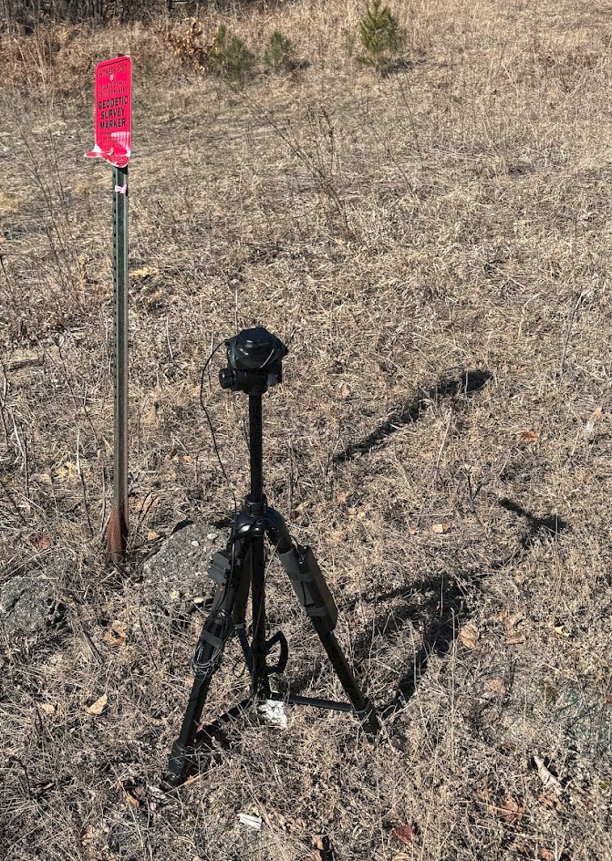

Abstract
========

This document contains the research notes, instructions, and findings of my search for a high accuracy/precision, cost effective, and easy to use GPS solution.  There are a significant number of tangents that I did not cover in this document as my primary intent was to document this for my own future reference.  

Problem Statement
=================

I want to find my property lines and they are not well marked, if at all.  The lines I am looking for are section and/or standard division lines - aka 40’s.  The consumer devices I have access to (iPhone/Androids) do not have sufficient accuracy/precision to determine locations of lines/corners.  The risk I am facing by misidentification of the lines is small and within my risk tolerance.  I enjoy technical challenges.

Disclaimer
==========

I am not a surveyor, forester, or some other type of property line finding expert.  The detail in this write-up was solely to explore the technical possibilities and learn a few things along the way.  If you are looking for the exact property lines, you need a surveyor.  It may be worth your time and effort to get “close” with the tools used here by documenting/charting out and flagging (non-destructively) where you believe lines/corners/etc are and provide all that to the surveyor when asking for quotes.  They will likely be able to use your work as a starting point.  You want a surveyor in any type of line dispute.  They will be able to guarantee the line placement exactly as well as have insurance to back up any mistakes that may have been made (e.g. you cut down a tree that was not really on your property).

Possibilities
=============

The ability to accurately find and/or chart points has way more usages that I can write-up here, but here are some that I am doing, or could possibly do in the future.

1.  Finding property lines/corners.  This write-up is focused on this one only.
2.  Increasing the accuracy of my Insta360 camera GPS by using logged GPS tracks from this solution.  The current Insta360 GPS solution uses either the phone’s GPS or the watch type “remote.”  When capturing video and coordinate paths for Google Maps StreetView, the accuracy is often problematic.  Being able to align the video with the cm-level GPS track would be helpful.
3.  Drone accuracy.  This is largely an area that has been done commercially ($$$), but I would like to more accurately track the drone’s location for better “timelapse” type photos, among other possibilities.
4.  Farm Tools - It looks like some of the farm tools using high precision GPS are very expensive and with a tech-savvy farmer, cost savings could be realized.  

Hardware
========

In my case, I had no idea what hardware made sense or even existed.  After much digging through “cheap” Surveyor tools in the $1000+ range, I came across the ZED-F9P chips.  These chips are used by a handful of suppliers and after more digging, I decided on the ArduSimple implementation.

RTK Portable Bluetooth Kit
--------------------------

[RTK Portable Bluetooth Kit, lightest solution with ZED-F9P - ArduSimple](https://www.google.com/url?q=https://www.ardusimple.com/product/simplertk2blite-bt-case-kit/&sa=D&source=editors&ust=1711550084449247&usg=AOvVaw0kWJkeAvxhx2CNVoJvwnVL)  This seemed like a perfect solution for what I wanted.  It has cm level precision and works off a battery pack, so it is easy to set up a rover.  The kit at the time I ordered it was AS-STARTKIT-BTCASE-L1L2-0-03.  This kit basically contains the following -

1.  simpleRTK2B Lite (with USB C power shield) - [simpleRTK2B Lite, multiband RTK GPS board w u-blox ZED-F9P - ArduSimple](https://www.google.com/url?q=https://www.ardusimple.com/product/simplertk2blite/&sa=D&source=editors&ust=1711550084449803&usg=AOvVaw3rdeAH_B6YNyJ9KKgZhbgt)
2.  Bluetooth Module (HC-05 in my case) - [Bluetooth module for the simpleRTK2B board - ArduSimple](https://www.google.com/url?q=https://www.ardusimple.com/product/bluetooth-module/&sa=D&source=editors&ust=1711550084450204&usg=AOvVaw2YwZc__mdT9nfwGR8prLy8)
3.  Ublox antenna - AS-ANT2B-ANN-L1L2-50SMA-00 - [u-blox GNSS Multiband antenna ANN-MB-00 (IP67) - ArduSimple](https://www.google.com/url?q=https://www.ardusimple.com/product/ann-mb-00-ip67/&sa=D&source=editors&ust=1711550084450582&usg=AOvVaw3_NZkDGvE5JgXqrhy2PMKM)
4.  Short USB A to USB C cable
5.  Custom case for the assembled parts

The Kit Arrived
---------------

It took about a week from order to arrival.  It was shipped from Spain to Minnesota, US.  I started unboxing and connected it up to my PC via USB C.  Started up, connected to u-center, and I was getting data.  Awesome.  Everything was configured and ready to use out of the box.  

Rover Setup Problems  
----------------------

I started to set up my rover and could not connect to bluetooth with my iPhone 15.  I started to dig and found the HC-05/HC-06 Bluetooth chipset was not compatible with iPhone or iPad.  Bummer.  I re-checked all the Ardusimple pages and I did find the note that the wireless connection is (android only).  I missed this the first time as I thought it was talking about the OTG/wired connection being Android only.  

Successful Rover Setup
----------------------

I happen to have an old Kindle Fire tablet that I was able to tweak with FireToolbox into getting the Amazon bloat off and the Google Play store on.  The Fire tablet connected to the Bluetooth chip and SW Maps was happy to read the incoming data.  The downside to this is my iPhone needs to have tethering enabled so the tablet can connect to the internet in the field.  Not a huge deal, but would be nice to have it in the same device.

iPhone Rover Plan
-----------------

I will be migrating from the Android tablet over to my iPhone as soon as the BT BLE chip (https://www.ardusimple.com/product/ble-bridge/) arrives in a week or so.  I did contact ArduSimple and they confirmed the new module will fit in the same place as the existing Bluetooth HC-05 module without any re-configuration.  

iPhone Rover Update
-------------------

The [BT BLT module](https://www.google.com/url?q=https://www.ardusimple.com/product/ble-bridge/&sa=D&source=editors&ust=1711550084452735&usg=AOvVaw13CpT0MyolFb8bg3TXwPBN) arrived and has been swapped out in the kit case.  The module was plug-and-play and provided data to the iPhone without any configuration beyond what was noted here - [How to connect RTK receiver to iOS device (iPhone or iPad) via BT+BLE Bridge? - ArduSimple](https://www.google.com/url?q=https://www.ardusimple.com/how-to-connectrtk-receiver-to-ios-device-iphone-ipad-or-ipod-via-bluetooth/&sa=D&source=editors&ust=1711550084453092&usg=AOvVaw2wMdZWCqWVTGGfX9c7Af7R)

Recommendation for ArduSimple
-----------------------------

Swap out the Bluetooth module on the RTK Portable Bluetooth Kit with the BT BLE module ([BT+BLE Bridge - ArduSimple](https://www.google.com/url?q=https://www.ardusimple.com/product/ble-bridge/&sa=D&source=editors&ust=1711550084453725&usg=AOvVaw2YZ2-3kpE0SDLfkQbO9El6)).  I believe they are aware of the shortcomings of the Bluetooth module on Apple products because the handheld kit that is very similar has the BT BLE Module in the current version (https://www.ardusimple.com/product/rtk-handheld-surveyor-kit/).  (emailed to ArduSimple March 2024)

Software
========

U-Center
--------

*   [u-center | u-blox](https://www.google.com/url?q=https://www.u-blox.com/en/product/u-center&sa=D&source=editors&ust=1711550084454441&usg=AOvVaw3qh8c1iVDpL7MrS6jkNoo7)
*   Version 23.08 for Windows 10 in my case.
*   I used the u-center tool to test functionality and check UART (how the main chip communicates with the USB and bluetooth chips) settings only.  
*   I did not need to tweak any settings on my unit from ArduSimple.
*   This software can configure a ton of settings on the various modules, including the ZED-F9P based module I have.  
*   U-Center can also show what is happening with the GPS data in visual ways.  It is useful for determining if your hardware is working.
*   NTRIP client connections can also be made with U-Center to validate your NTRIP caster setup/connection.

SW Maps
-------

*   SW Maps seems to be the most feature-rich tool for my use case.
*   No cost.  Works well.
*   Available for iOS and Android.  
*   It can view various points/lines saved in layers.
*   It can have multiple projects.
*   It can save points, tracks, and photos for later review/export.  
*   Has an NTRIP Client to connect to your Base/NTRIP Caster service.  
*   There is a desktop app used to help format files for the mobile versions, but I did not find utility in the desktop tool in my use case.

Google Earth Pro
----------------

*   Various desktop versions.  I used the Windows 10 version.
*   Easy to use.
*   Free.  
*   Does various lat/long conversions for you.  
*   Imports and exports various files - KML was used in my case.  

File Sync Tool
--------------

*   I happen to use DropBox, Google Drive, and OneDrive, but you only need one to make things simpler.  
*   The web-based file sync tool is used to save files on a device and make them accessible on other devices.  For example - the exported KML data from Google Earth Pro on PC can be placed in the DropBox/OneDrive folder and then can be accessed by the mobile device.
*   This is not 100% necessary, but if you use email (or some other method), you will have to adjust the instructions below to fit your preferred method of transferring files to and from the various devices you are using.  

Services
========

NTRIP Caster
------------

*   Lots of possibilities here.  You can use similar hardware to the “rover” to build a base station and use radios and/or the internet to communicate between base and rover.  Depending on your situation, this can vary wildly, and is outside the scope of this write-up.
*   My Solution - The State of MN has a NTRIP caster service called MNCORS.  This service is publicly accessible and free to use.  Account setup is somewhat manual and may take a few business days.  They have nearly complete coverage across the state and make it super easy to use/connect.  

*   More info - [MnCORS Network - Land Management - MnDOT](https://www.google.com/url?q=https://www.dot.state.mn.us/surveying/cors/&sa=D&source=editors&ust=1711550084458400&usg=AOvVaw3J3qZackCa1SnnWJn1lKzK)
*   Sensor Map - [Sensor Map](https://www.google.com/url?q=http://mncors.dot.state.mn.us/Map/SensorMap.aspx&sa=D&source=editors&ust=1711550084458843&usg=AOvVaw1DJTz41YP_aS9PXwN02dXD)

*   Other States/Countries -

*   I did a quick search of a few random states and found they offer a similar service to MN, often using the exact same looking pages (trimble back-end is looks like).  Search for something like  “STATE NTRIP CORS” or “STATE DOT NTRIP CORS” in google and it will likely find something.
*   It may be possible to use the NOAA CORS network also, but I did not see a sign-up in the brief search.  [All NGS CORS Sites - National Geodetic Survey](https://www.google.com/url?q=https://geodesy.noaa.gov/CORS/sort_sites.shtml&sa=D&source=editors&ust=1711550084459424&usg=AOvVaw1oSR8cUIu5ZxvTYD_0cHMA)

*   Note - the accuracy/precision of the Zed-F9P chip may be sufficient for your needs without the use of an NTRIP base station caster or NTRIP caster service.  I found the error is ~500mm without ntrip and ~10mm with ntrip.  

Public GIS
----------

*   The City/County/State/Country public-facing GIS system in your area is a wealth of information on property lines, wetland areas, corners, owners, 911 access points, etc.  
*   I found the GIS system to have various tools to pull lat/long details (typically near the measure tool) to help with the transfer of specific points to Google Earth Pro and/or SW Maps.
*   The accuracy of the lines and corners may be a bit off compared to corner cards and/or other methods.  You will want to be wary when using this to find points.  See the Disclaimer section above and the Sources of Error section below for more.  In my use case, I am looking for section corners/lines as well as standard divisions of sections, typically 40 Acre parcels.  
*   I have found the validated corner cards and the corners in the GIS are within inches, even when the corner card has a noted accuracy of +/- 2m.  Conversely, I have also found the GIS maps were drawn incorrectly after reviewing the legal description filed with the county.

County Corner Cards
-------------------

*   Just like the Public GIS services, some areas will offer GIS layers, or separate links to a GIS system where Corner Cards are mapped out.
*   The corner cards may also be in another database that may be accessible to the public.  Check your city/county/state/national websites.
*   These corner cards contain a wealth of information as to the positioning of the corner of a section specific property, the accuracy/precision of the recorded point and other useful details for finding/calculating lines/points.

MN HARN Points
--------------

*   Minnesota maintains a database (and GIS layer) with various types of survey points.  
*   These points are noted if they can be used for vertical and/or horizontal measurements and usually are linked to a technical sheet with useful historical data and measurements, including height and lat/long.  
*   [Parcel Viewer](https://www.google.com/url?q=https://mndot.maps.arcgis.com/apps/webappviewer/index.html?id%3D2e478054c72745eab7141f705d3dc5d2&sa=D&source=editors&ust=1711550084461483&usg=AOvVaw2uTCkfg0jKKpejpPgGLWjI)
*   I used these points to validate the setup and test accuracy/precision.  See Appendix for test details.  

NOAA HARN Points
----------------

*   For those in the US, the NOAA has a huge map of the points with links to the specifics.  
*   [NGS Map](https://www.google.com/url?q=https://noaa.maps.arcgis.com/apps/webappviewer/index.html?id%3D190385f9aadb4cf1b0dd8759893032db&sa=D&source=editors&ust=1711550084462368&usg=AOvVaw0gi3Mf-Ygn4tBlNkqI3jbr)
*   I found most of these are included in the MN/State level tool for my state also.

Setup the Rover
===============

Base Config
-----------

1.  Install SW Maps on Mobile

1.  Found in the Apple App Store or Google Play store depending on your device.

2.  Install Dropbox

1.  Install on your desktop
2.  Install on mobile
3.  Set up or login to your account.
4.  Create a “1 Maps” folder to hold files - The 1 at the start of the name makes it easier to find at the top of the list if you have a lot of files/folders.

3.  Optional - Install “Ntrip checker” or similar app on your mobile if you want to validate your ntrip connectivity.  
4.  See ArduSimple’s writeup here - [User Guide: RTK Portable Bluetooth Kit - ArduSimple](https://www.google.com/url?q=https://www.ardusimple.com/user-guide-rtk-portable-bluetooth-kit/&sa=D&source=editors&ust=1711550084464090&usg=AOvVaw3BGmrKtJRdy9PZryPuXVYD)

Bluetooth Device Config
-----------------------

*   The bluetooth device will be slightly different depending on your application.  In my case, I just opened the Bluetooth connection tool on the Android tablet and connected it to the RTK\_something\_### bluetooth device.  On my iPhone, it shows up exactly as outlined in the documentation here - [How to connect RTK receiver to iOS device (iPhone or iPad) via BT+BLE Bridge? - ArduSimple](https://www.google.com/url?q=https://www.ardusimple.com/how-to-connectrtk-receiver-to-ios-device-iphone-ipad-or-ipod-via-bluetooth/&sa=D&source=editors&ust=1711550084464810&usg=AOvVaw3JScimB9c0678hkIo_4Yya)
*   Once connected to the device, it shows up in SW Maps as an option under Bluetooth GNSS Device.
*   One Config note - I needed to play with the “Instrument Model” Selector a bit to get the Android to properly see the data coming in.  I believe on Android I ended up with “SparkFUN RTK” or similar.
*   See the write-up on the Ardusimple page for more - [User Guide: RTK Portable Bluetooth Kit - ArduSimple](https://www.google.com/url?q=https://www.ardusimple.com/user-guide-rtk-portable-bluetooth-kit/&sa=D&source=editors&ust=1711550084465570&usg=AOvVaw3M4DgAsONhkdWS-BTXiBmN)

NTRIP Config
------------

The Ntrip config was also fairly straightforward and followed the instructions on the ARDUSimple Page fairly directly - [User Guide: RTK Portable Bluetooth Kit - ArduSimple](https://www.google.com/url?q=https://www.ardusimple.com/user-guide-rtk-portable-bluetooth-kit/&sa=D&source=editors&ust=1711550084466227&usg=AOvVaw0ccNCr94S1W7jRu2lALRTk)

1.  Open the NTRIP connection settings.  On Android, I had to connect a Bluetooth device with RTK before this option showed up.  On iPhone, it was always there.
2.  Enter your caster server details.  

1.  In my case, I used the State of MN details they sent me along with the password that I needed to set.  
2.  I used the mount point of RTCM\_32\_NAD83(2011)
3.  The two options at the bottom needed to be checked in my case.  (Send NMEA…, and Apply Base Station Antenna PCO)

3.  Once you click connect, you should see a data stream in the bottom left showing data flowing (it should be a changing number above 0 B/s)

Usage Instructions - Prep Work
==============================

Note - these details are only part of what the software can do.  There is a ton more it can do, and probably better ways to do what I am outlining below.  

Field Prep
----------

Prior to going into the field, there are a few things I do to make sure I know what I am looking for.  This list changes depending on what my goal is for the day.

1.  Scope out the area in the local (County in my case) GIS viewer.  Look at where the lines are, what lines I may want to locate.
2.  Check the legal descriptions for the parcels on the lines I am looking at.  See if they make sense compared to the GIS.
3.  See if any Corner Cards exist for the lines.
4.  Start a spreadsheet with the following point data/columns: PointName, Lat, Long, method of finding that point (GIS Click, Corner Card, Legal Description, etc), Notes, and any other columns you may need.  This data can be all pulled into Google Earth and then over to SW Maps.  The Lat/Long can be in any standard format that Google Earth Pro understands (Decimal degrees or D, M, S.sss in my case)
5.  Start a spreadsheet with “lines” you want to draw.  Each corner should have the points noted (likely from the above list of points).  I found curves can be difficult, so I typically only use straight lines as they work for my use cases…so far.

How to add points in Google Earth Pro
-------------------------------------

Two Methods I have used-

1.  Import a CSV.  I took the Spreadsheet from the Prep Work section above and exported it to CSV.  From there, you can import into Google Earth Pro without much issue.  It also converts the points if you use different formats.  After importing, you can file these points into a folder in the “My Places” structure in Google Earth.  
2.  Add a manual point.  Search for a location via lat, long in the search box in Google Earth Pro.  Click on the point in the list and add to my places. File it into the my places folder that makes sense.

Tip: Use the “folder” structure of My Places in Google Earth Pro as it will help when building layers later on.  For example:  I have a top level folder called “Land Project 1” and then under that folder, I have folders called: Mapped Points, Found Points, Lines, Tracks.  These then will form the basis for layers in the mobile app later on.  

How to add Lines in Google Earth Pro
------------------------------------

The drawing tools for very specific lines in Google Earth Pro are not present.  I wanted to create a simple line between two of my known points,but this feature did not exist.  

Here is what I ended up doing -

1.  Open the path tool and draw a line.  It can be anywhere, just needs to have a start and an end.  
2.  Name the path and set any color/symbols/etc you would like.
3.  Save the Google Earth Pro workspace - (Crtl+s)
4.  Close Google Earth
5.  Browse to the location of the Google Earth Pro KML Data File - myplaces.kml

1.  C:\\Users\\USER\\AppData\\LocalLow\\Google\\GoogleEarth
2.  Note - your location may be different depending on install and OS.  

6.  Open the file in a text editor like Notepad or Notepad++
7.  It will look something like this (when using Notepad++ with XML formatting)

1.  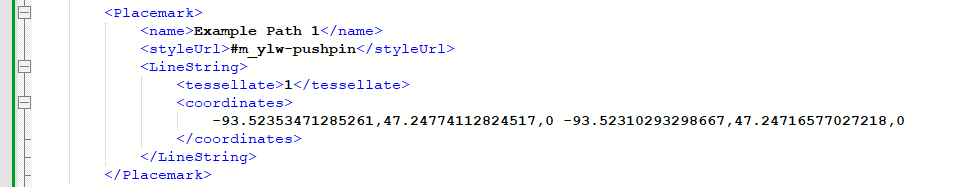

8.  The trick here is to change the coordinates to the line you want.

1.  The formatting on the coordinates is basically point 1, then a space, then point 2, then a space, then point 3, then a space, then point 4, etc….
2.  I pulled the specific coordinates of my line points from elsewhere in the file as I had previously saved them as “SW Corner of Parcel 1” or “SE Corner of Parcel 1” and so on.  I just copied and pasted the lat/longs.  
3.  I left the third bit of data as 0 so the line would be pinned to the group.  If you wanted height you could change the 0 to whatever value in meters.  

9.  You can then copy and paste the block of XML code for all the lines you want.  Like this -

1.  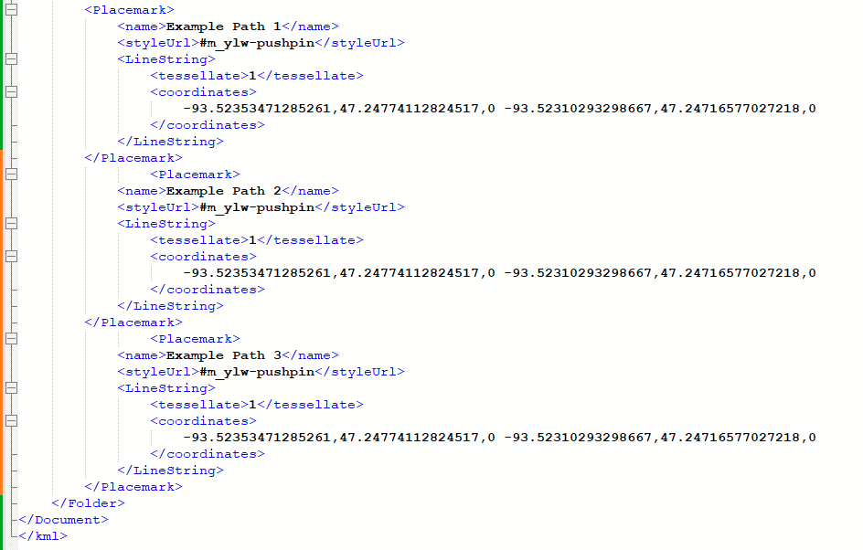

10.  Save the KML file in the text editor and open Google Earth Pro
11.  Your line(s) should now appear in the left side and display on the map -

1.  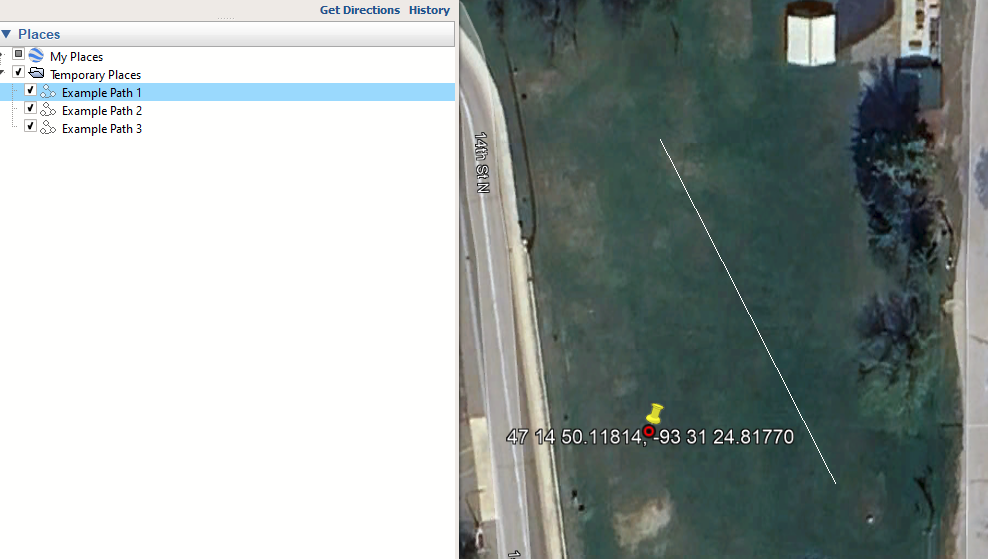

How to load data from Google Earth Pro to SW Maps
-------------------------------------------------

There may be a way to do this with the SWMaps tool for Windows Desktops, but I found it easier to do this -

1.  In Google Earth Pro -

1.  Arrange your points/lines into folders and/or Folders in folders.  For example I create a top level folder called something like “Land Project 1” and then under there, i create new folders for “GIS Points,” “Corner Points,” “Lines from Corner Points.” Interesting features.” etc.  These sub-folders will become layers that I can turn on and off later on.  
2.  Set your icon/line types of each folder of points/lines.  If you make them different, it will help to identify what you are looking at later.  
3.  Right click on the collection of points (folders on the left) that you want to make into a layer in SW Maps.
4.  Select “Save Place as”
5.  Save the KML type file to your “1 maps” folder in your file sync service that you set up in the previous section.  I typically like to name these files so I know what they are later on.  For example -

1.  2024-04-01-SmithLand-CornerPoints and 2024-04-01-SmithLand-LinesviaCornerPt

6.  Repeat for all the points you want to transfer over to SW maps.  I have 4-6 files per project in my use case, but yours may be different.  

2.  On SW Maps on the mobile device -

1.  Launch “Files” app
2.  Locate the files you want to import - in my case, i used Dropbox folder “1 Maps”
3.  Select and copy the files you want to import.  This is a bit different for iOS and Android, but basically, i can select multiple files and then “copy”
4.  Copy to the SW Maps folder - Device files - SW maps - Layers - KML
5.  Launch SW Maps
6.  Create a new project - I mimic the name I used on the files above - “2024 SmithLand”
7.  Go to Layers
8.  Touch add layer

How to get data from SW Maps to use in Google Earth Pro
-------------------------------------------------------

Usage Instructions - In the Field
=================================

Rover Startup
-------------

1.  Power up the rover by connecting the USB port on the GPs unit to the battery bank.
2.  On your mobile device, connect to bluetooth
3.  Load SW Maps
4.  Touch the top left SW Maps icon
5.  Touch Bluetooth GNSS Connection
6.  Select your bluetooth device
7.  Touch connect.
8.  Once the GPS is showing data, close the Bluetooth screen.
9.  Touch the NTrip Client option
10.  Touch connect.
11.  You should now see the data stream showing activity at the bottom left.  
12.  Close the NTRIP client options
13.  Select GNSS Status
14.  You should see the current position, connection, the accuracy, and other details.

SW Maps Selecting Layers
------------------------

Adding a found Point
--------------------

Recording a Track
-----------------

Usage Instructions - Post Field
===============================

Exporting Data from SW Maps
---------------------------

Importing Data into Google Earth Pro
------------------------------------

Sources of Error
================

There are a few sources of error that I found.  Due to the errors, I always erred on the side of caution and did not do any type of work (tree cutting, tail building, etc) within the margin of error plus an additional “safety” margin.  Your risk tolerance and trust in your data/gear/abilities will need to dictate what you are comfortable with.  See Disclaimer section for more - when in doubt, hire it out to a surveyor.  

1.  GPS errors - The gear is not “certified” or “calibrated.”  This error when comparing to known points is negligible, but still could be a factor.
2.  GPS Signal - I plan to use this in forested areas.  Tree cover will impact the level of accuracy/precision.
3.  Erroneous data from the ntrip caster.  In my case, the ntrip caster is widely used and trusted, however, error is still possible.
4.  A disconnected NTRIP client could be missed.
5.  Angled rover stick.  I have a simple bubble level on the tripod I use, but in the woods, it will take additional time to level the tripod.  
6.  Local GIS Mapping - I have had a case where the GIS mapping was found to contain incorrect lines when compared to the legal description in a fairly complex description.  The GIS admins fixed this when raised.  

How to reduce error -
---------------------

1.  Good gear.  While I am using non-certified, non-calibrated gear, it is far better than regular non-specialist gear.
2.  Validation of gear with known coordinates.  I used MN HARN points.  See the questions section below for more.
3.  Keep an eye on the “error” noted for Lat, Long, Horizontal, and vertical in the app.  Excess error could be a failed NTRIP connection, poor coverage due to tree cover, or other issues that will need to be investigated.
4.  NTRIP CORS RTK.  Make sure to use NTRIP corrections from a reputable source.
5.  Use GIS Mapping - The local GIS mapping for my use case (simple, square, 40 Acre parcels based on calculations from section corners) was found to be highly accurate (within inches of documented corner points).
6.  Legal descriptions

1.  The County website, Recorder, Public Facing GIS, or other source of public land data will have detailed legal descriptions that can be complicated, or simple.  Check the legal description to validate what you are seeing elsewhere.  

7.  Use multiple sources of data.  

1.  GIS, Legal descriptions, corner cards, etc should all be reviewed and assessed for accuracy/anomalies.  

Questions
=========

How precise is this?
--------------------

*   Testing without NTRIP corrections, the software shows an error of ~500mm.  
*   Testing with NTRIP corrections - the software shows an error of 10mm.
*   When tested at known points (MN HARN points) it matched exactly with the published, certified values.
*   See the Tests in the appendix for the details.

How much did all this cost?
---------------------------

In March 2024 -

*   Main Kit  - $336.38 usd
*   BT BLE Module - $83.95 usd
*   Fire Tablet - this was a used tablet I had on hand (Fire 9) and can be found on ebay for cheap.
*   iPhone - Had on hand.  My personal daily driver device.
*   Tripod - had on hand - It was a cheap one on Amazon - maybe $40 usd
*   Battery Pack - Had on hand - This was a standard Aker pack from about 5 years ago.  Maybe $40 usd

Appendix
========

Precision Test 1 - DOAN
-----------------------

*   Photos -

*   
*   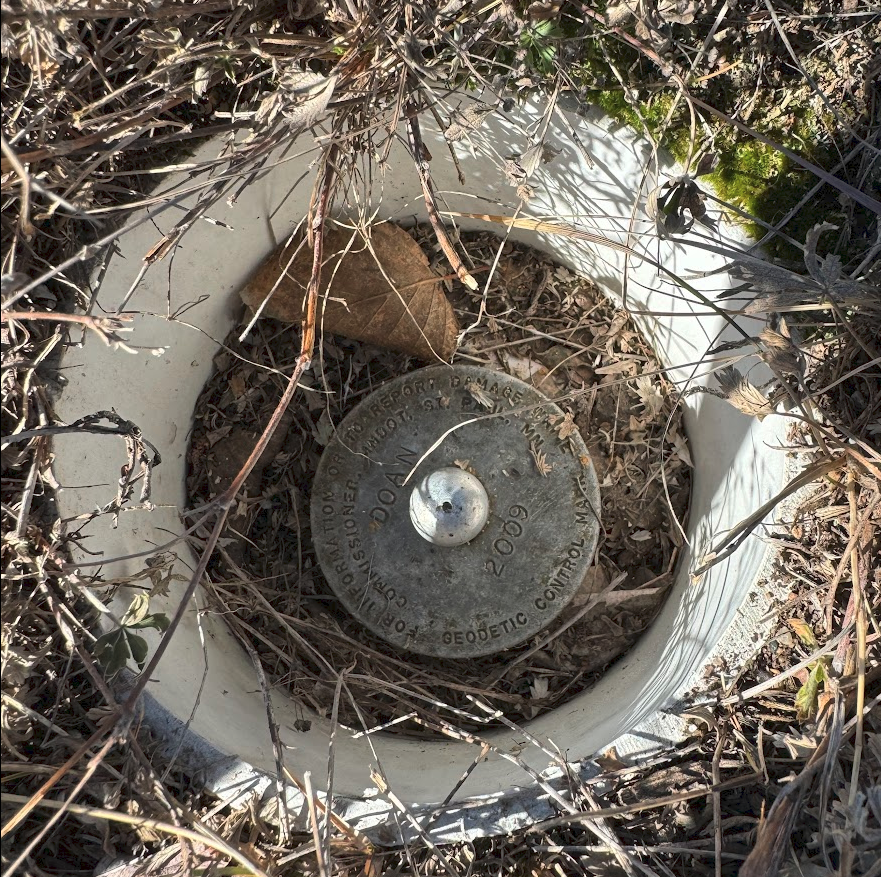
*   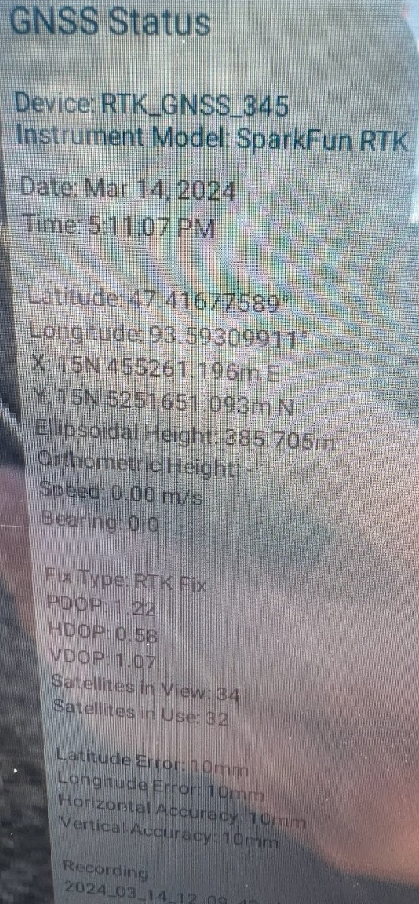

*   State Data Sheet -

*   [https://www.olmweb.dot.state.mn.us/Geod/PDF%20Single%20Sheet/GSID\_87772.pdf](https://www.google.com/url?q=https://www.olmweb.dot.state.mn.us/Geod/PDF%2520Single%2520Sheet/GSID_87772.pdf&sa=D&source=editors&ust=1711550084480280&usg=AOvVaw1SEFpBRXRtuk1rZCqPaGJ1)

*   State GPS Coordinates

*    47.416776°, -93.593099°

*   State Ellipsoid Height

*   1265.529

*   DIY GPS Coordinates

*   47.41677589, -93.59309911

*   DIY Ellipsoid Height

*   385.705m = 1265.436 ft

*   Delta in coordinates-

*   ~14.77mm
*   Note - the state point I used in the calculation may have been a rounded value and if my GPS point was rounded to the same number of digits, we would be exactly the same.  

*   Delta in height -

*   0.093 ft
*   Note - I did not set/measure the height of the sensor when I set up the tripod.  I just eyeballed a meter.

Precision Test 2 - 3108 AZ
--------------------------

*   Photos -

*   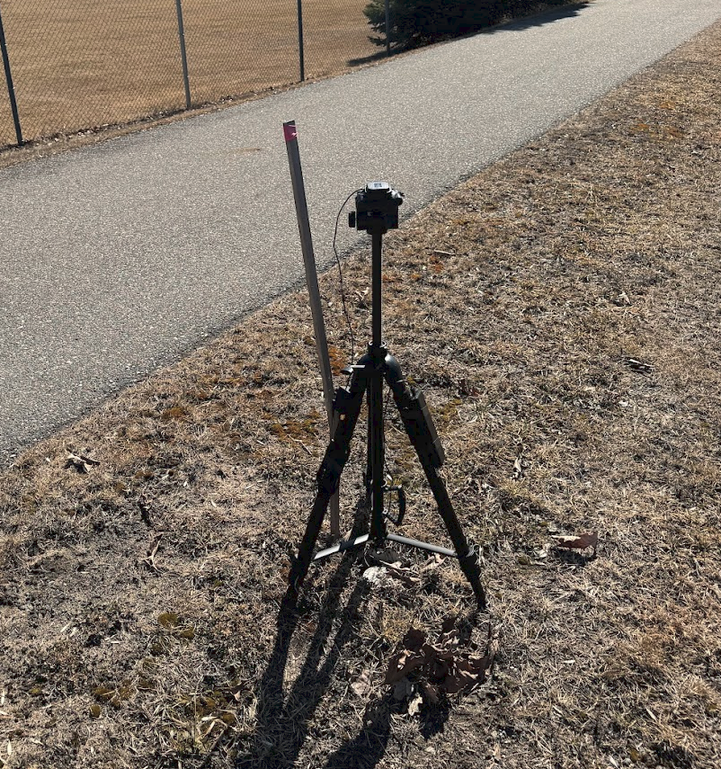
*   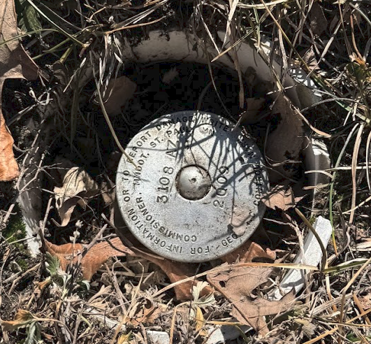
*   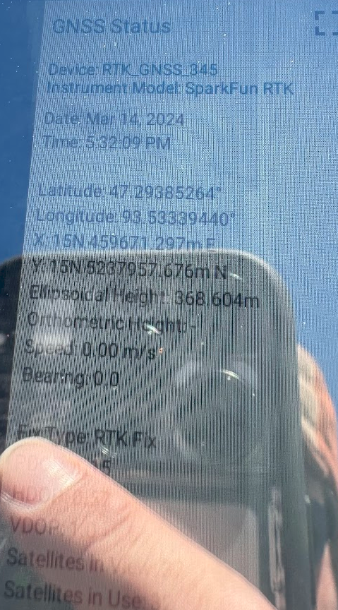

*   State Data Sheet -

*   https://www.olmweb.dot.state.mn.us/Geod/PDF%20Single%20Sheet/GSID\_87763.pdf

*   State GPS Coordinates

*     47.293853°, -93.533395°

*   State Ellipsoid Height

*   1209.381

*   DIY GPS Coordinates

*   47.29385264, -93.53339440

*   DIY Ellipsoid Height

*   368.604m = 1209.331 ft

*   Delta in coordinates-

*   ~60.42mm
*   Note - the state point I used in the calculation may have been a rounded value and if my found GPS point was rounded to the same number of digits, we would be exactly the same.  

*   Delta in height -

*   0.05 ft
*   Note - I did not set/measure the height of the sensor when I set up the tripod.  I just eyeballed a meter.

Precision Test 3 - FAIR
-----------------------

*   Photos -

*   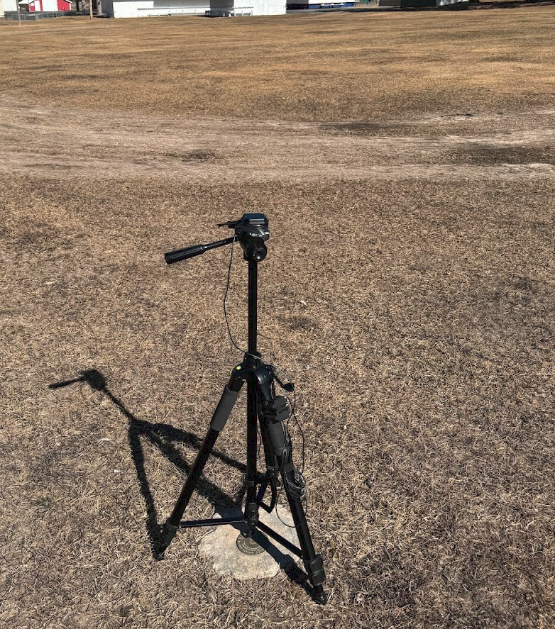
*   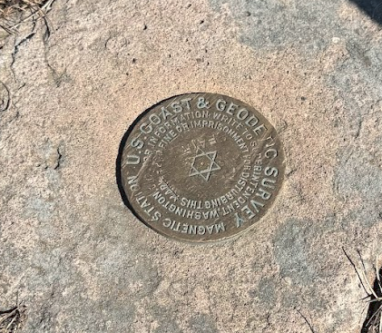
*   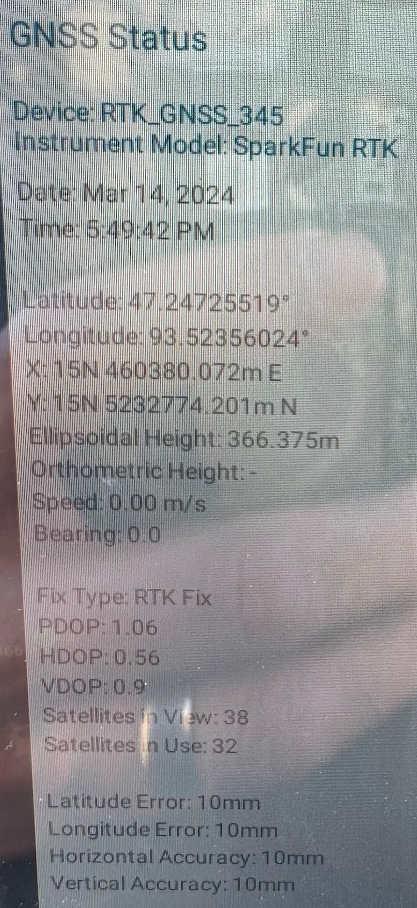

*   State Data Sheet -

*   https://www.olmweb.dot.state.mn.us/Geod/PDF%20Single%20Sheet/GSID\_64366.pdf

*   State GPS Coordinates

*   47.247255°, -93.523560°

*   State Ellipsoid Height

*   1202.192

*   DIY GPS Coordinates

*   47.24725519, -93.52356024

*   DIY Ellipsoid Height

*   366.375m = 1202.018 ft

*   Delta in coordinates-

*   ~37.83mm
*   Note - the state point I used in the calculation may have been a rounded value and if my found GPS point was rounded to the same number of digits, we would be exactly the same.  

*   Delta in height -

*   0.174 ft
*   Note - I did not set/measure the height of the sensor when I set up the tripod.  I just eyeballed a meter.

* * *

Precision Test 4 - GPS vs Corner Card vs GIS Corner
---------------------------------------------------

*   I found two pins on my property that had corner cards published by the county.  
*   These two images show the GPS location, the Corner Card Location and the GIS Corner position.  
*   The GPS location is on the pin, or very close to being on the pin.
*   The Corner Card location is the one that is offset just a touch from the lines.
*   The GIS corner is on the corner of the Red lines.
*   Given the stated accuracy of the corner card and GIS, all points fall well within the margin of error.  

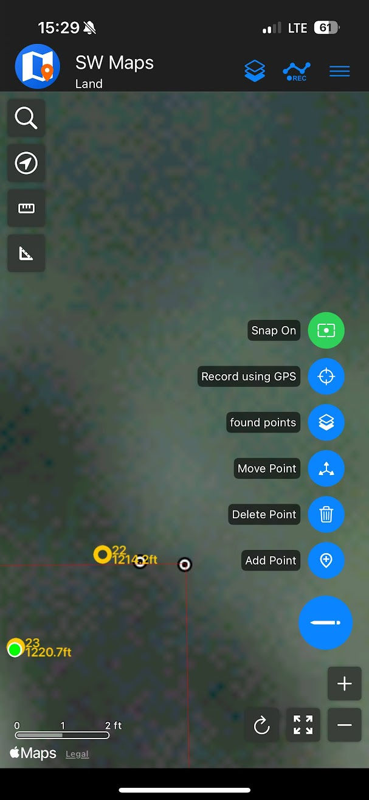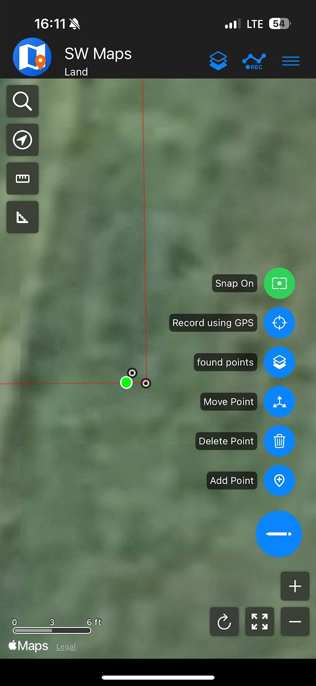
